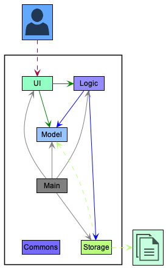
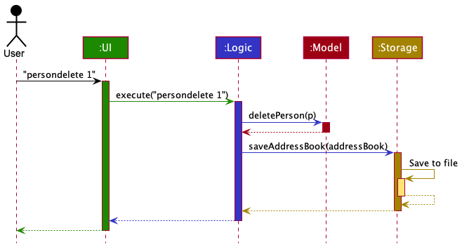
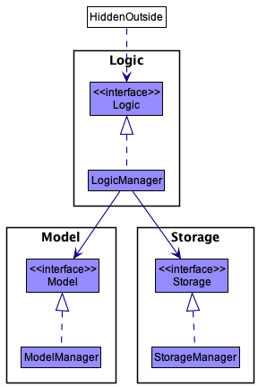
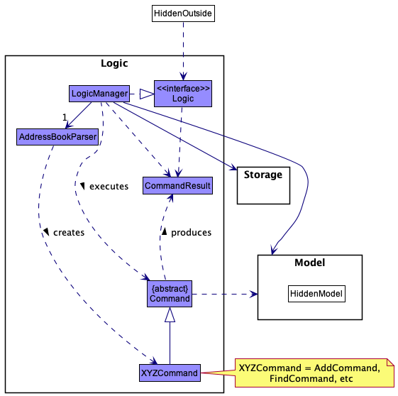
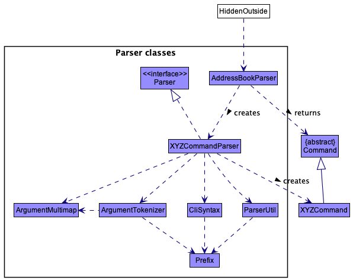
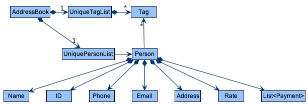
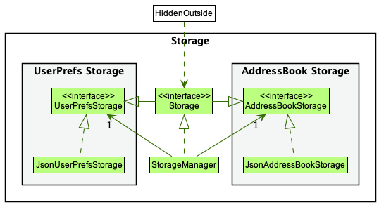
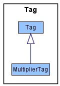

## Introduction

PeopleSoft is a desktop app for **calculating the salary for shift-based contractors**, optimized for use via a **Command Line Interface (CLI)**. If you are a **HR manager** and you can type fast, PeopleSoft can get your payroll tasks done **much faster** than traditional GUI apps.

**PeopleSoft helps to:**
* Simplify the management of data
* Reduce menial labour
* Reduce mistakes due to human error in calculation / accidental edits
* Help employees be assured that their hours and pay are registered correctly in the system

--------------------------------------------------------------------------------------------------------------------

* Table of Contents
{:toc}

--------------------------------------------------------------------------------------------------------------------

## Acknowledgements

* Project adapted from [addressbook-level3](https://se-education.org/addressbook-level3/DeveloperGuide.html#product-scope)
* Layout of user stories adapted from [TAB](https://ay2122s1-cs2103t-f13-3.github.io/tp/DeveloperGuide.html#user-stories)
* {list here sources of all reused/adapted ideas, code, documentation, and third-party libraries -- include links to the original source as well}

--------------------------------------------------------------------------------------------------------------------

## Setting up, getting started

Refer to the guide [_Setting up and getting started_](SettingUp.md).

--------------------------------------------------------------------------------------------------------------------

## Design

:bulb: <b>Tip:</b> The `.puml` files used to create diagrams in this document can be found in the [diagrams](https://github.com/se-edu/addressbook-level3/tree/master/docs/diagrams/) folder. Refer to the [_PlantUML Tutorial_ at se-edu/guides](https://se-education.org/guides/tutorials/plantUml.html) to learn how to create and edit diagrams.

### Architecture

*Figure 1. Architecture diagram of the high-level design of PeopleSoft*

Given below is a quick overview of main components and how they interact with each other.

**Main components of the architecture**

**`Main`** has two classes called [`Main`](https://github.com/AY2122S2-CS2103T-T11-4/tp/blob/master/src/main/java/peoplesoft/Main.java) and [`MainApp`](https://github.com/AY2122S2-CS2103T-T11-4/tp/blob/master/src/main/java/peoplesoft/MainApp.java). It is responsible for,
* At app launch: Initializing the components in the correct sequence, and connecting them up with each other.
* At shut down: Shutting down the components and invoking cleanup methods where necessary.

[**`Commons`**](#common-classes) represents a collection of classes used by multiple other components.

The rest of the application consists of four components.

* [**`UI`**](#ui-component): The UI of the App.
* [**`Logic`**](#logic-component): The command executor.
* [**`Model`**](#model-component): Holds the data of the App in memory.
* [**`Storage`**](#storage-component): Reads data from, and writes data to, the hard disk.

**How the architecture components interact with each other**

*Figure 2. Sequence diagram showing component interactions when the user enters the command `persondelete 1`*

Each of the four main components (also shown in the diagram above),

* defines its *API* in an `interface` with the same name as the component.
* implements its functionality using a concrete `{Component Name}Manager` class (which follows the corresponding API `interface` mentioned in the previous point).

For example, the `Logic` component defines its API in the `Logic.java` interface and implements its functionality using the `LogicManager.java` class which follows the `Logic` interface. Other components interact with a given component through its interface rather than the concrete class (reason: to prevent outside component's being coupled to the implementation of a component), as illustrated in the (partial) class diagram below.

*Figure 3. Partial class diagram of the interaction of components*

The sections below give more details of each component.

### UI component

The **API** of this component is specified in the [`Ui.java`](https://github.com/AY2122S2-CS2103T-T11-4/tp/blob/master/src/main/java/peoplesoft/ui/Ui.java) interface.

*Figure 4. Class diagram of GUI*

The UI consists of a `MainWindow` that is made up of parts e.g.`SideBar`, `CommandBox`, `ResultDisplay`, `OverviewPage`, etc. All these, including the `MainWindow`, inherit from the abstract `UiPart` class which captures the commonalities between classes that represent parts of the visible GUI.

The `UI` component uses the JavaFx UI framework. The layout of these UI parts are defined in matching `.fxml` files that are in the `src/main/resources/view` folder. For example, the layout of the [`MainWindow`](https://github.com/AY2122S2-CS2103T-T11-4/tp/blob/master/src/main/java/peoplesoft/ui/MainWindow.java) is specified in [`MainWindow.fxml`](https://github.com/AY2122S2-CS2103T-T11-4/tp/blob/master/src/main/resources/view/MainWindow.fxml)

The `UI` component,

* executes user commands using the `Logic` component.
* listens for changes to `Model` data so that the UI can be updated with the modified data.
* keeps a reference to the `Logic` component, because the `UI` relies on the `Logic` to execute commands.
* depends on some classes in the `Model` component, as it displays the `Person` and `Job` objects residing in the `Model`.

### Logic component

The **API** of this component is specified in the [`Logic.java`](https://github.com/AY2122S2-CS2103T-T11-4/tp/blob/master/src/main/java/peoplesoft/logic/Logic.java) interface.

Here's a (partial) class diagram of the `Logic` component:

*Figure 5. Partial class diagram of the `Logic` component*

How the `Logic` component works:
1. When `Logic` is called upon to execute a command, it uses the `AddressBookParser` class to parse the user command.
2. This results in a `Command` object (more precisely, an object of one of its subclasses e.g., `JobAddCommand`) which is executed by the `LogicManager`.
3. The command can communicate with the `Model` when it is executed (e.g. to add a person).
4. The result of the command execution is encapsulated as a `CommandResult` object which is returned back from `Logic`.

*Figure 6. Sequence diagram of the interactions within the `Logic` component for the `execute("delete 1")` API call*

:information_source: <b>Note:</b> The lifeline for `JobDeleteCommandParser` should end at the destroy marker (X) but due to a limitation of PlantUML, the lifeline reaches the end of diagram.

Here are the other classes in `Logic` (omitted from the class diagram above) that are used for parsing a user command:

*Figure 7. Class diagram of the Parser component, a subcomponent of the Logic component*

How the parsing works:
* When called upon to parse a user command, the `AddressBookParser` class creates an `XYZCommandParser` (`XYZ` is a placeholder for the specific command name e.g., `JobAddCommandParser`) which uses the other classes shown above to parse the user command and create a `XYZCommand` object (e.g., `JobAddCommand`) which the `AddressBookParser` returns back as a `Command` object.
* All `XYZCommandParser` classes (e.g., `JobAddCommandParser`, `JobDeleteCommandParser`, ...) inherit from the `Parser` interface so that they can be treated similarly where possible e.g, during testing.

### Model component
The **API** of this component is specified in the [`Model.java`](https://github.com/AY2122S2-CS2103T-T11-4/tp/blob/master/src/main/java/peoplesoft/model/Model.java) interface.

*Figure 8. Class diagram of the `Model` component*

The `Model` component,

* stores the address book data - i.e. all `Person` objects (which are contained in a `UniquePersonList` object), all `Job` objects (which are contained in a `UniqueJobList` object), and auxiliary classes `Employment`, `PaymentHandler` etc.
* allows for the automatic serialization and deserialization of `AddressBook` objects (and any component objects, e.g. `Person`, `Email`, etc) to and from JSON.
* stores the currently 'selected' `Person` objects (e.g., results of a search query) as a separate _filtered_ list which is exposed to outsiders as an unmodifiable `ObservableList<Person>` that can be 'observed' e.g. the UI can be bound to this list so that the UI automatically updates when the data in the list change.
* stores the currently 'selected' `Job` objects (e.g., results of a search query) as a separate _filtered_ list which is exposed to outsiders as an unmodifiable `ObservableList<Job>` that can be 'observed' e.g. the UI can be bound to this list so that the UI automatically updates when the data in the list change.
* stores a `UserPref` object that represents the user’s preferences. This is exposed to the outside as a `ReadOnlyUserPref` objects.
* contains an `Employment` class which represents the associations between `Person` and `Job` objects.
* does not depend on any of the other three components (as the `Model` represents data entities of the domain, they should make sense on their own without depending on other components)

A more detailed model of `Person` and `Job` is given below. Notice the association class `Employment` between `Person` and `Job`.

*Figure 9. Class diagram of `Person` and `Job`*

### Storage component

The **API** of this component is specified in the [`Storage.java`](https://github.com/AY2122S2-CS2103T-T11-4/tp/blob/master/src/main/java/peoplesoft/storage/Storage.java)

*Figure 10. Class diagram of the Storage component*

The `Storage` component,
* can save both address book data and user preference data in JSON format, and read them back into corresponding objects.
* inherits from both `AddressBookStorage` and `UserPrefStorage`, which means it can be treated as either one (if only the functionality of only one is needed).
* depends on some classes in the `Model` component (because the `Storage` component's job is to save/retrieve objects that belong to the `Model`)

### Common classes

Classes used by multiple components are in the `peoplesoft.commons` package.

--------------------------------------------------------------------------------------------------------------------

## Implementation

This section describes some noteworthy details on how certain features are implemented.

### JSON serialization and deserialization

The serialization and deserialization of model objects (e.g. `AddressBook`, `UniquePersonList`, `Person`, `Job`, `Tag`) is handled by custom serializers and deserializers, implemented as nested class within each model class.

These serializers and deserializers are automatically used by Jackson during serialization and deserialization.

The serializer and deserializer for each class determine how the objects are to be serialized and deserialized, including but not limited to:
* which fields are to be stored,
* how each field should be (de)serialized, e.g. by directly converting it to/from a JSON type, or by delegating it to Jackson (which will use the serializer/deserializer for the field type), and
* how the fields and current object are to be represented as (or parsed from) JSON values, e.g. objects, strings, numbers.

This architecture has some advantages:
* The serdes implementations are kept together with the related classes; developers adding new model classes will not have to modify files in other packages.
   * The previous implementation (with `JsonAdaptedPerson` etc.) requires that developers update the `JsonAdapted` classes belonging in the `Storage` component; this may not be immediately evident to developers.
* Developers adding new model classes can incorporate existing types (that already have corresponding serializers/deserializers) without needing to duplicate the serdes code, unlike with the previous implementation.
* Developers will also not need to (practically) duplicate classes, e.g. `Job` -> `JsonAdaptedJob` (with the `@JsonCreator` annotation), just so that Jackson has something to serialize from/deserialize to.

However, it also has some drawbacks:
* It can be rather verbose, since each serializer/deserializer class contains a portion of boilerplate code
* Developers writing serializers/deserializers will need to have basic knowledge of JSON, e.g. the types that are available, the structure of JSON objects and arrays, etc
* Some knowledge of Jackson components (e.g. `JsonParser`, `JsonGenerator`, `ObjectNode`) is also required, as developers will need to use them to write values to/read values from the internal Jackson representation of a JSON value/object.

### The `Find` command

The `Find` command is an enhancement of the `Find` feature provided in AB3.
It is structured using an object of `PersonContainsKeywordPredicate`, adapted from `NameContainsKeywordPredicate`. It
has the following attributes:
* `static final String COMMAND_WORD` initialised to `'find'`
* `static final String MESSAGE_USAGE` initialised to the relevant message.
* `PersonContainsKeywordPredicate predicate` used to find `Person` objects that match with the given keyword.

Applying this filter to the entire list means that only `Persons` that match **ALL** the keywords would be retained in
the filtered list.

#### The `PersonContainsKeywordPredicate` class

The **match** itself is defined as follows (within the `PersonContainsKeywordPredicate` class which implements the
`Predicate` interface):
If a `Person` contains **ALL** the keywords passed in the query, either in their `name` field or as equivalent to an
element in their `tags` set of `Tag` objects, then, passed as a parameter to `test()`,
it is a valid match.

The implementation is achieved through using stream manipulations to iterate through each person object,
and for any such object, iterating through each keyword passed in the query. The keyword is then checked if it is
contained within the name or among the tags.

One motivation behind using streams rather than iteration was that streams can be better optimized, given the need or
bandwith arising later.

### The `JobList` interface and `UniqueJobList` class

The `JobList` is an interface for the list of jobs, that implements the `Iterable` interface and supports minimal list
operations.

The `UniqueJobList` class implements the `JobList` interface to that enforces uniqueness between its elements and does
not allow nulls.
Furthermore, it has the following attributes, to interact with `java.fx` effectively.
* `ObservableList<Job> internalList`
* `ObservableList<Job> internalUnmodifiableList`

### The `Job` class

The `Job` class is an abstraction for a job stored in PeopleSoft. A `Job` object is immutable and contains the
following attributes:
* `String jobId` - Jobs are referenced by this attribute.
* `String desc` - A user-readable description of this job.
* `Duration duration` - The duration that a job has been worked. Is used together with `rate` to calculate the
  total job earnings. Uses `java.time.Duration`.
* `boolean hasPaid` - A boolean to denote if this job is completed. Used to calculate the salary of a
  `Person`.
* `boolean isFinal` - A boolean to denote if this job has finalized payments.

The use of immutability ensures that there are no unintended side effects of modifying a `Job`.
Whenever a `Job` needs to be modified (for example setting the value of `hasPaid`), a new immutable copy
of the `Job` with the desired changes is created to replace the old instance. Two `Job` objects are considered
the same job if they share the same `jobId`, which can be compared using `Job#isSameJob()`.

### The `Job` and `Person` association - `Employment`

In order to represent how a job may be assigned to a person (or a person may take on a job) in real life, an
association class `Employment` is used. The class handles the following responsibilities:
* Assigning a `Job` to a `Person`.
* Removing all necessary associations on the deletion/edit of a `Job` or `Person`.
* Filtering the `Job` objects that are mapped to a `Person`.

In the current implementation, there is a many-to-many mapping of `Job` objects to `Person` objects. An
association can be created using `Employment#associate(job, person)`. The jobs are internally referenced by
`jobId`, while the persons are referenced by `personId`. Currently, the class `Employment` is written as a
singleton. This may be changed to be a field of `AddressBook` due to potential obstacles with the testing of
the serialization/deserialization of the class.

#### Design considerations:

**Aspect: How the relational mapping between Job and Person is stored:**

* **Alternative 1 (current choice):** Saves the mapping of `Job` objects to `Person` objects in `Employment`.
    * Pros: Guarantee of commutative association.
    * Cons: Harder to implement.

* **Alternative 2 (rejected):** Saves a map of the ids of related `Person` objects in `Job` objects, and a map of the ids of related `Job` objects in `Person` objects.
    * Pros: Easier to implement.
    * Cons: Mutual associations are not guaranteed. The possible extension of a one-to-many relationship between `Person` and `Tag` would be harder to implement.

### \[Proposed\] Addition of pay multipliers to Job

The proposed mechanism for adding pay multipliers to `Job` is facilitated by `MultiplierTag`. `MultiplierTag` extends `Tag` with a multiplier addition timeline history, stored internally as a `MultiplierHistory` Map between pay multiplier values and their time of addition. 

The inclusion of `MultiplierTag` in calculating pay `Job` objects is facilitated by `PaymentHandler#createPendingPayments` which calls on the modified operation `Job#calculatePay(Set<Tags>)`. `Job#calculatePay(Set<Tags>)` returns the appropriately scaled pay amount after accounting for every tag the passed `Person` parameter has. `Job#calculatePay()` is called by calls `Job#calculatePay()` based on optional `Tag` parameters.

#### Design considerations:
* **Alternative 1 (current choice):** Saves a Map of previous multipliers and time of addition in Tag.
    * Pros: Easy to implement. Pay breakdown can be useful in the implementation of other features.
    * Cons: May have performance issues in terms of memory usage.

* **Alternative 2:** Saves pay amount as a fixed value and updates it when Tag is edited.
    * Pros: Will use less memory as only one value is being stored.
    * Cons: Loss of useful pay breakdown information.

### \[Proposed\] Undo/redo feature

#### Proposed Implementation

The proposed undo/redo mechanism is facilitated by `VersionedAddressBook`. It extends `AddressBook` with an undo/redo history, stored internally as an `addressBookStateList` and `currentStatePointer`. Additionally, it implements the following operations:

* `VersionedAddressBook#commit()` — Saves the current address book state in its history.
* `VersionedAddressBook#undo()` — Restores the previous address book state from its history.
* `VersionedAddressBook#redo()` — Restores a previously undone address book state from its history.

These operations are exposed in the `Model` interface as `Model#commitAddressBook()`, `Model#undoAddressBook()` and `Model#redoAddressBook()` respectively.

Given below is an example usage scenario and how the undo/redo mechanism behaves at each step.

Step 1. The user launches the application for the first time. The `VersionedAddressBook` will be initialized with the initial address book state, and the `currentStatePointer` pointing to that single address book state.

Step 2. The user executes `delete 5` command to delete the 5th person in the address book. The `delete` command calls `Model#commitAddressBook()`, causing the modified state of the address book after the `delete 5` command executes to be saved in the `addressBookStateList`, and the `currentStatePointer` is shifted to the newly inserted address book state.

Step 3. The user executes `add n/David …​` to add a new person. The `add` command also calls `Model#commitAddressBook()`, causing another modified address book state to be saved into the `addressBookStateList`.

:information_source: **Note:** If a command fails its execution, it will not call `Model#commitAddressBook()`, so the address book state will not be saved into the `addressBookStateList`.

Step 4. The user now decides that adding the person was a mistake, and decides to undo that action by executing the `undo` command. The `undo` command will call `Model#undoAddressBook()`, which will shift the `currentStatePointer` once to the left, pointing it to the previous address book state, and restores the address book to that state.

:information_source: **Note:** If the `currentStatePointer` is at index 0, pointing to the initial AddressBook state, then there are no previous AddressBook states to restore. The `undo` command uses `Model#canUndoAddressBook()` to check if this is the case. If so, it will return an error to the user rather
than attempting to perform the undo.

The following sequence diagram shows how the undo operation works:

:information_source: **Note:** The lifeline for `UndoCommand` should end at the destroy marker (X) but due to a limitation of PlantUML, the lifeline reaches the end of diagram.

The `redo` command does the opposite — it calls `Model#redoAddressBook()`, which shifts the `currentStatePointer` once to the right, pointing to the previously undone state, and restores the address book to that state.

:information_source: **Note:** If the `currentStatePointer` is at index `addressBookStateList.size() - 1`, pointing to the latest address book state, then there are no undone AddressBook states to restore. The `redo` command uses `Model#canRedoAddressBook()` to check if this is the case. If so, it will return an error to the user rather than attempting to perform the redo.

Step 5. The user then decides to execute the command `list`. Commands that do not modify the address book, such as `list`, will usually not call `Model#commitAddressBook()`, `Model#undoAddressBook()` or `Model#redoAddressBook()`. Thus, the `addressBookStateList` remains unchanged.

Step 6. The user executes `clear`, which calls `Model#commitAddressBook()`. Since the `currentStatePointer` is not pointing at the end of the `addressBookStateList`, all address book states after the `currentStatePointer` will be purged. Reason: It no longer makes sense to redo the `add n/David …​` command. This is the behavior that most modern desktop applications follow.

The following activity diagram summarizes what happens when a user executes a new command:

#### Design considerations:

**Aspect: How undo & redo executes:**

* **Alternative 1 (current choice):** Saves the entire address book.
  * Pros: Easy to implement.
  * Cons: May have performance issues in terms of memory usage.

* **Alternative 2:** Individual command knows how to undo/redo by
  itself.
  * Pros: Will use less memory (e.g. for `delete`, just save the person being deleted).
  * Cons: We must ensure that the implementation of each individual command are correct.

_{more aspects and alternatives to be added}_

### \[Proposed\] Data archiving
A simple archival feature can be easily implemented, as all of the app data can be (and is currently) stored in a single file. 

As such, it should be trivial to add an `archive` command, which saves a copy of the database to a different filename. Auto-archival should also be possible, e.g. by saving a copy of the database on every X changes, or if the last archive was made more than Y hours ago.

The archived data files may not be as user-friendly though -- restoring data archives will require users to copy an archived copy of the database to the expected location, then restarting the application.

We might hence want to implement a rudimentary interface with which users can browse through older archives -- this interface might show basic information about each archive, such as:

- date of archive
- number of employees/jobs
- size of archive

...as well as provide an easy way to load the archive into the app temporarily, which can be implemented as follows:

1. save the current database somewhere
2. make a copy of the archive
3. set the storage filename to point to the archive copy
4. reload the application, if required

If the user desires to return to the original database, then we can simply load the database saved in Step 1 and reload the application.

--------------------------------------------------------------------------------------------------------------------

## Documentation, logging, testing, configuration, dev-ops

* [Documentation guide](Documentation.md)
* [Testing guide](Testing.md)
* [Logging guide](Logging.md)
* [Configuration guide](Configuration.md)
* [DevOps guide](DevOps.md)

--------------------------------------------------------------------------------------------------------------------

## Appendix: Requirements

### Product scope

**Target user profile**:
HR Managers of companies offering contractor services
* have a need to manage a significant number of employees and jobs
* employee pay is calculated based on hours worked
* prefer desktop apps over other types
* can type fast
* prefer typing to mouse interactions
* are reasonably comfortable using CLI apps

**Value proposition**:
* Simplify the management of data
* Reduce menial labour
* Reduce mistakes due to human error in calculation / accidental edits
* Helps employees be assured that their hours and pay are registered correctly in the system

### User stories
For convenience, our user stories have been categorized with three broad labels: 
1. [E] - Employee-related functions
2. [J] - Job-related functions
3. [N] - Neither of the above 

Note: multiple labels can be applied to a single user story.

Priorities: High (must have) - `* * *`, Medium (nice to have) - `* *`, Low (unlikely to have) - `*`

| Label | Priority | As a …​        | I want to …​                                                                   | So that I can…​                                                               |
|-------|----------|----------------|--------------------------------------------------------------------------------|-------------------------------------------------------------------------------|
| N     | `* *`    | new user       | see usage instructions                                                         | refer to instructions when I forget how to use the App                        |
| N     | `* *`    | potential user | see the app populated with sample data                                         | easily see how the app will look like when it is in use                       |
| N     | `* *`    | HR Manager     | log into separate modes for HR-related functions and for job-related functions | easily access relevant data for the type of work I am doing at any given time |
| N     | `* * *`  | HR Manager     | load and save data in human-readable data files                                | I can backup the data externally or access it in a different application      |                                                                           |
| N     | `* * *`  | HR Manager     | exit the application                                                           |
| E     | `* * *`  | HR Manager     | add a new employee                                                             |                                                                               |
| E     | `* * *`  | HR Manager     | add tags to employees                                                          | identify their roles                                                          |
| E     | `* * *`  | HR Manager     | edit an employee's information                                                 | rectify mistakes or update their personal information if need be              |
| E     | `* * *`  | HR Manager     | delete an employee                                                             |                                                                               |
| E     | `* * *`  | HR Manager     | delete all employees                                                           | mass-remove entries that I no longer need                                     |
| E     | `* * *`  | HR Manager     | list all employees                                                             |                                                                               |
| E     | `* * *`  | HR Manager     | find an employee by name or tag                                                | locate details of employees without having to go through the entire list      |
| J     | `* * *`  | HR Manager     | add a new job                                                                  |                                                                               |
| J     | `* * *`  | HR Manager     | mark a job as having been paid for                                             |                                                                               |
| J     | `* * *`  | HR Manager     | mark a job as having been completed                                            |                                                                               |
| J     | `* * *`  | HR Manager     | update a job                                                                   |                                                                               |
| J     | `* * *`  | HR Manager     | delete a job                                                                   |                                                                               |
| J     | `* * *`  | HR Manager     | delete all jobs                                                                | mass-remove entries that I no longer need                                     |
| J     | `* * *`  | HR Manager     | find a job by description                                                      | locate details of jobs without having to go through the entire list           |
| EJ    | `* * *`  | HR Manager     | assign an employee to a job                                                    |                                                                               |
| EJ    | `* * *`  | HR Manager     | view the salary owed to a given employee                                       | pay them                                                                      |
| EJ    | `* * *`  | HR Manager     | pay for a given type of job                                                    |                                                                               |
| EJ    | `* * *`  | HR Manager     | see which jobs each employee is working on                                     | pay them accordingly                                                          |
| EJ    | `* *`    | HR Manager     | edit pay multiplier factors (e.g. overtime, experience, emergency on-calls)    | apply changes in payment policies across the organization                     |

### Use cases

(For all use cases below, the **System** is `PeopleSoft` and the **Actor** is the `user`, unless specified otherwise)

**Use case: Delete an employee**

**MSS**

1.  User requests to list employees
2.  PeopleSoft shows a list of employees
3.  User requests to delete a specific employee in the list
4.  PeopleSoft deletes the employee

    Use case ends.

**Extensions**

* 2a. The list is empty.

  Use case ends.

* 3a. The given index is invalid.

    * 3a1. PeopleSoft shows an error message.

      Use case resumes at step 2.

**Use case: Update an employee's data**

**MSS**

1.  User requests to list employees
2.  PeopleSoft shows a list of employees
3.  User requests to edit a specific employee in the list with the updated information
4.  PeopleSoft updates the employee to match user input

    Use case ends.

**Extensions**

* 2a. The list is empty.

  Use case ends.

* 3a. The given index is invalid.

    * 3a1. PeopleSoft shows an error message.

      Use case resumes at step 2.

### Non-Functional Requirements

1. Should work on any _mainstream OS_ as long as it has Java 11 or above installed.
2. Should be able to hold up to 1000 persons without a noticeable sluggishness in performance for typical usage.
3. Should not rely on database-management systems to store data.
4. Should not require an installer; should be packaged into a single reasonably-sized (i.e. within 100MB) JAR file.
5. Should not be hosted on remote servers.
6. Should not make use of proprietary third-party frameworks, libraries and services.
7. Should have a responsive GUI. GUI should function well (i.e., should not cause any resolution-related inconveniences to the user) for standard screen resolutions and higher and for screen scales 100% and 125%. GUI should be usable - even if suboptimal - for resolutions 1280x720 and higher and for screen scales 150%.
8. A user with above average typing speed for regular English text (i.e. not code, not system admin commands) should be able to accomplish most of the tasks faster using commands than using the mouse.

### Glossary

* **Mainstream OS**: Windows, Linux, Unix, OS-X
* **Standard screen resolution**: 1920x1080

--------------------------------------------------------------------------------------------------------------------

## **Appendix: Instructions for manual testing**

Given below are instructions to test the app manually.

:information_source: <b>Note:</b> These instructions only provide a starting point for testers to work on;
testers are expected to do more *exploratory* testing.

### Launch and shutdown

1. Initial launch

    1. Download the jar file and copy into an empty folder

    1. Double-click the jar file Expected: Shows the GUI with a set of sample contacts. The window size may not be optimum.

1. Saving window preferences

    1. Resize the window to an optimum size. Move the window to a different location. Close the window.

    1. Re-launch the app by double-clicking the jar file. 
       Expected: The most recent window size and location is retained.

### Adding an employee

Adding an employee while employees are being shown

Prerequisites: List all employees using the `list` command. Multiple employees in the list.

- Test case: `personadd n/Nicole Tan p/99338558 e/nicole@stffhub.org a/1 Tech Drive, S138572 r/37.50 t/Hardware t/Senior` Expected: An employee with the corresponding details will be added to the end of the employee list. Details of the added employee will be shown in the status message.
- Test case: `personadd p/99338558 e/nicole@stffhub.org a/1 Tech Drive, S138572 r/37.50 t/Hardware t/Senior` Expected: No employee is added. The expected format of the `personadd` command will be shown in the status message.
- Test case: `personadd n/Nicole p/9 e/nicole@stffhub.org a/1 Tech Drive, S138572 r/37.50 t/Hardware t/Senior` 
  Expected: No employee is added. The expected format of `Phone` will be shown in the status message.

Other incorrect `personadd` commands to try: `personadd`, `personadd n/Nicole`, `...`  
Expected: Similar to previous.

### Deleting an employee

1. Deleting an employee while all employees are being shown

    1. Prerequisites: List all employees using the `list` command. Multiple employees in the list.

    1. Test case: `delete 1` 
       Expected: First employee is deleted from the list. Details of the deleted employee shown in the status message.

    1. Test case: `delete 0` 
       Expected: No employee is deleted. Error details shown in the status message. Status bar remains the same.

    1. Other incorrect delete commands to try: `delete`, `delete x`, `...` (where x is larger than the list size) 
       Expected: Similar to previous.

2. Deleting an employee after a find command is executed

    1. Prerequisites: List all persons using the `list` command. Multiple persons in the list.

    2. Test case: `delete 1` 
       Expected: First contact is deleted from the observable list. Details of the deleted contact shown in the status message. Entering the `list` command shows that the employee that was originally in the first index is not deleted (unless the position of the employee was the same after the `find` command).

    3. Test case: `delete 0` 
       Expected: No person is deleted. Error details shown in the status message. Status bar remains the same.

    4. Other incorrect delete commands to try: `delete`, `delete x`, `...` (where x is larger than the list size) 
       Expected: Similar to previous.
