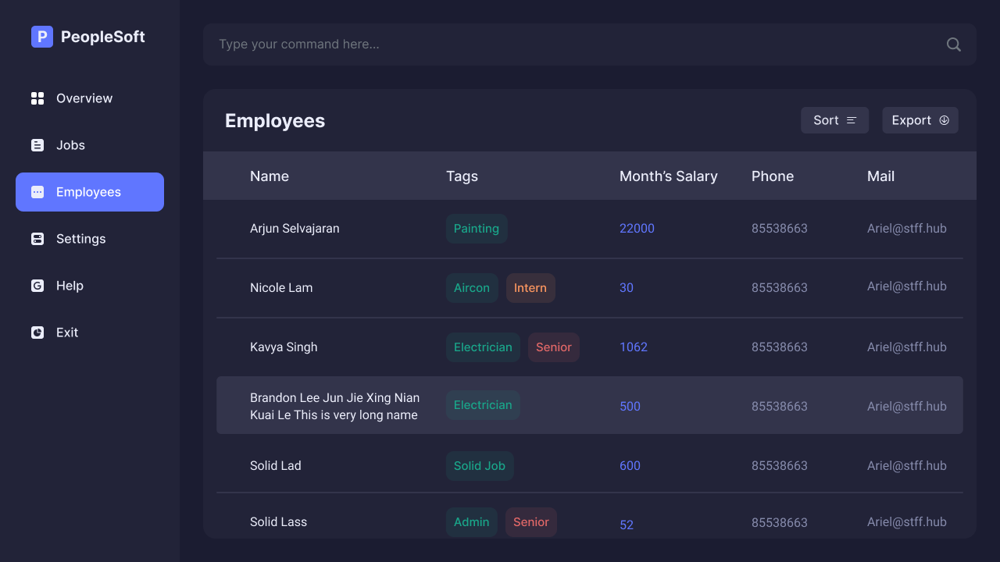

PeopleSoft is a desktop app for **calculating the salary for shift-based contractors**, optimized for use via a **Command Line Interface (CLI)**. If you are a **HR manager** and you can type fast, PeopleSoft can get your payroll tasks done **much faster** than traditional GUI apps.

You can input your employees' data and the jobs that you want to keep track of.
Then, you can assign the employees to the jobs that they are working on.
After the job is completed, you can mark the job as paid, and PeopleSoft will calculate how much each employee is to be paid based on their hourly rates. 
You can also generate a PDF payslip for your employees to refer to.

## How to use this guide

**:information_source: How to use this guide:** 

* Words in `this format` are commands to be typed into PeopleSoft. 

* Words in square brackets are optional. 
  e.g. `n/NAME [t/TAG]` can be used as `n/John Doe t/friend` or as `n/John Doe`.

* Table of Contents
{:toc}

--------------------------------------------------------------------------------------------------------------------

## Quick start

1. Ensure you have Java `11` or above installed in your Computer. Follow [this guide](https://docs.oracle.com/en/java/javase/11/install/overview-jdk-installation.html#GUID-8677A77F-231A-40F7-98B9-1FD0B48C346A) to do so.

2. Download the latest version of the application from [here](https://github.com/AY2122S2-CS2103T-T11-4/tp/releases). Select the `peoplesoft.jar` file.

3. Move it to the folder that you want the data to be saved in.

4. Double-click the file to start the app. The GUI should appear as pictured in a few seconds. If this does not work on your system, open an instance of the command line (command prompt for Windows, the terminal on Mac and Linux), navigate to directory where the file is located, and type `java -jar peoplesoft.jar`. Note how the app contains some sample data.

  
 
    
   _The PeopleSoft interface_

  

7. Type the command in the command box and press Enter to execute it. e.g. typing **`help`** and pressing Enter will open the help window. You can try out any command from the [Command Summary](#command-summary) below.

8. Refer to the [Features](#features) below for details of each command.

--------------------------------------------------------------------------------------------------------------------
## Command summary

A handy reference for more experienced users who just need to know the format of a command.

| Command     | Format                                                                                   | Examples                                                                                                |
|-------------|------------------------------------------------------------------------------------------|---------------------------------------------------------------------------------------------------------|
| `add`       | `add n/NAME p/PHONE_NUMBER e/EMAIL a/ADDRESS r/RATE [t/TAG]...​`                         | `add n/Nicole Tan p/99338558 e/nicole@stffhub.org  a/1 Tech Drive, S138572 r/37.50 t/Hardware t/Senior` |
| `edit`      | `edit PERSON_INDEX [n/NAME] [p/PHONE_NUMBER] [e/EMAIL] [a/ADDRESS] [r/RATE] [t/TAG]...​` | `edit 2 n/Nicole Lee t/OS`                                                                              |
| `delete`    | `delete PERSON_INDEX`                                                                    | `delete 3`                                                                                              |
| `find`      | `find KEYWORD [MORE_KEYWORDS]...​`                                                       | `find Nicole Hardware`, `find Aircon`                                                                   |
| `list`      | `list`                                                                                   | NA                                                                                                      |
| `clear`     | `clear`                                                                                  | NA                                                                                                      |
| `job`       | `job n/NAME d/DURATION`                                                                  | `job n/Fix HDB Lock d/1`                                                                                |
| `joblist`   | `joblist`                                                                                | NA                                                                                                      |
| `jobdelete` | `jobdelete JOB_INDEX`                                                                    | `jobdelete 3`                                                                                           |
| `mark`      | `mark JOB_INDEX`                                                                         | `mark 2`                                                                                                |
| `assign`    | `assign JOB_INDEX i/PERSON_INDEX [i/PERSON_INDEX]...​`                                   | `assign 2 i/1`                                                                                          |
| `pay`       | `pay JOB_INDEX y/`                                                                       | `pay 2 y/`                                                                                              |
| `exit`      | `exit`                                                                                   | NA                                                                                                      |
| `help`      | `help`                                                                                   | NA                                                                                                      |
--------------------------------------------------------------------------------------------------------------------

## Features

**:information_source: Notes about the command format:** 

* Words in `UPPER_CASE` are the attributes to be filled in by you. 
  e.g. in `add n/NAME`, the `NAME` attribute could be `add n/John Doe`.
 
* Attributes can be in any order. 
  e.g. if the command asks for `n/NAME p/PHONE_NUMBER`, `p/PHONE_NUMBER n/NAME` is also fine.

* Items in square brackets are optional. 
  e.g. `n/NAME [t/TAG]` can be typed as `n/John Doe t/friend` or as `n/John Doe`.

* Items with `...​` after them can be used multiple times including zero times. 
  e.g. `[t/TAG]...​` can be used as `t/friend`, `t/friend t/family` or even 0 times.

* If an attribute is expected only once, but you type it multiple times, only the last occurrence of the attribute will be taken. 
  e.g. if you specify `n/Jake n/Jason`, only `n/Jason` will be taken.

* For commands that do not need attributes, (like `help`, `list`, `exit` and `clear`) anything typed after the command word will be ignored. 
  e.g. typing `help 123`, it will be interpreted as `help`.

--------------------------------------------------------------------------------------------------------------------

## Employee-related commands

### Add an employee : `add`

Adds a new employee to the system with the given attributes.

Rate refers to the hourly pay of the employee.

Format: `add n/NAME p/PHONE_NUMBER e/EMAIL a/ADDRESS r/RATE [t/TAG] [t/TAG]...`

Example: `add n/Nicole Tan p/99338558 e/nicole@stffhub.org a/1 Tech Drive, S138572 r/37.50 t/Hardware t/Senior`

### Edit an employee’s information : `edit`
Edit the information of an existing employee. Use this in the event that an employee's details change.

Format: `edit PERSON_INDEX [n/NAME] [p/PHONE_NUMBER] [e/EMAIL] [a/ADDRESS] [r/RATE] [t/TAG]...​`

Example: `edit 2 p/62353535` edits the second person's phone number to 62353535

### Delete an employee : `delete`
Deletes the employee referred to by the index. This is irreversible. Removes the deleted employee from all associated jobs as well.

Format: `delete PERSON_INDEX`

Example: `delete 3` deletes the third person

### Search for a person by name or tag : `find`
Finds all people by a certain name and/or tag. If you wish to search by tags alone, use a `*` instead of typing a name.
If multiple tags are entered, only entries that match **all** tags are returned.

Format: `find [* OR NAME] [TAG]...​`

Examples:

`find Nicole Hardware` finds all the employees named ‘Nicole’, with the ‘Hardware’ tag

`find Nicole` finds all the employees named ‘Nicole’

`find * Hardware` finds all employees tagged with ‘Hardware’

`find Nicole Hardware Display` finds all employees named ‘Nicole’, tagged with BOTH 'Hardware' AND 'Display'

### List all persons : `list`
Lists all the employees in the company.

Format: `list`

Example: `list` shows all the employees in the company

### Clear all entries : `clear`

Removes all the employees’ information in the company from the app. Useful for clearing out sample data. 
❗️Caution: You cannot recover the data afterwards.

[coming in v1.3] Require confirmation with a `yes clear` for clearing all data with `clear`.
Format: `clear`

Example: `clear` removes all the employees and jobs from the app

--------------------------------------------------------------------------------------------------------------------

## Job-related commands

### Add a job : `job`

Adds a new job to the system with the given attributes. `RATE` refers to how much the employee is paid per hour. `DURATION` refers to how long the job took.

Format: `job n/NAME d/DURATION`

Example: `job 2 n/Fix HDB Lock r/40 d/1` creates a job with id 2, where the employees worked for 1 hour and are paid an hourly rate of $40 to fix a HDB lock

### List all jobs : `joblist`

Lists all the jobs you have created, including jobs that have been paid for and those that have not been paid for yet.

Format: `joblist`

Example: `joblist` lists all the jobs you have created

### Delete a job : `jobdelete`

Deletes the job that was referred to by the index.

❗️Caution: This is irreversible.

Format: `jobdelete JOB_INDEX`

Example: `jobdelete 2` deletes the second job

### Mark a job as done or not done : `mark`

Indicates that a job has been completed and is pending payment. To un-mark an object, `mark` the job again.
A job needs to be [assigned](#assign-a-job-to-an-employee--assign) to at least one person before it can be marked.

Format: `mark JOB_INDEX`

Example: `mark 2` marks the second job

Example: `mark 2` un-marks the second job after the previous example is performed

### Assign a job to an employee : `assign`

Assigns a job to an employee that is working on it. A [marked](#mark-a-job-as-paid--mark) job cannot be assigned to
any person.

Format: `assign JOB_INDEX i/PERSON_INDEX [i/PERSON_INDEX]...`

Example: `assign 2 i/3` assigns the second job to the first employee

### Finalize payments for a job : `pay`

Finalizes the payments of a job. This command is irreversible, and the finalized job cannot be
modified in any way except by `clear`. A job needs to be [marked](#mark-a-job-as-paid--mark) before it can be
finalized.

Format: `pay JOB_INDEX y/`

Example: `pay 2 y/` finalizes the payments of the second job

--------------------------------------------------------------------------------------------------------------------

## Miscellaneous commands

### Exit the program : `exit`
Exits the program immediately.

Format: `exit`

### List all the commands: `help`
Opens the help page which shows the command list like the one above.

Format: `help`

Prompted when the user makes a typo (i.e. tries to use an invalid command) :
Format: `Looks like you used an invalid command. Use the command help to access a list of all available commands.`

--------------------------------------------------------------------------------------------------------------------

## FAQ

**Q**: How do I save the data?

**A**: PeopleSoft automatically saves the data to the folder you placed it in automatically after any command that changes the data. There is no need to save manually.

**Q**: What happens if I want to edit the data externally?

**A**: PeopleSoft data is saved as a JSON file under `/data/peoplesoft.json`. 

❗️Caution: Do not edit the data directly unless you are sure that its format will remain valid. If your changes to the data file makes its format invalid, PeopleSoft will discard all data and start with an empty data file at the next run.

**Q**: How do I transfer my data to another Computer?

**A**: Install the app in the other computer and overwrite the empty data file it creates with your existing PeopleSoft data file.

**Q**: How do I report a bug? How do I suggest a feature?

**A**: You may create an issue under the `Issues` tab on our [GitHub Page](https://github.com/AY2122S2-CS2103T-T11-4/tp/tree/v1.3.tag). You may suggest a feature in the same way.

--------------------------------------------------------------------------------------------------------------------

## Glossary

**Index**: The item's number in a list.

e.g. The second person in the list has an `INDEX` of 2.
