Welcome to PeopleSoft!

PeopleSoft is a desktop application for **calculating the salary for shift-based contractors**, optimized for use via a **command-line interface (CLI)**. If you are a **HR manager** and you can type fast, PeopleSoft can get your payroll tasks done **much faster** than traditional graphical user interface (GUI) applications.

You can input your employees' data and the jobs that you want to keep track of.
Then, you can assign the employees to the jobs that they are working on.
After the job is completed, you can mark the job as paid, and PeopleSoft will calculate how much each employee is to be paid based on their hourly rates.
You can also generate a payslip in comma-separated values (CSV) format for you and your employees to refer to.

PeopleSoft simulates a real life workflow:
  * The company receives a new job.
  * The HR manager `add`s the job to PeopleSoft, and `assign`s employees to work on it.
  * The employees start working. 
  * When the employees complete the job, the HR manager `mark`s the job as completed.
  * Once it is time to pay the employees, `pay` out the job and `export` the payslips for the employees.

**:information_source: How to use this guide:** 

* Words in `monospace font` are commands to be typed into PeopleSoft. 

* Boxes like these (with a blue background and the :information_source: icon) contain relevant tips for using PeopleSoft.

* Boxes with a yellow background and the :warning: icon contain important warnings.

--------------------------------------------------------------------------------------------------------------------

* Table of Contents 
{:toc}
--------------------------------------------------------------------------------------------------------------------

## Quick start

### Running PeopleSoft for the first time

1. Ensure you have Java 11 or above installed on your computer. Follow [**this guide**](https://docs.oracle.com/en/java/javase/11/install/overview-jdk-installation.html#GUID-8677A77F-231A-40F7-98B9-1FD0B48C346A) to do so.

2. **Download** the latest version of `peoplesoft.jar` from [**here**](https://github.com/AY2122S2-CS2103T-T11-4/tp/releases).

3. Place the `peoplesoft.jar` file anywhere on your computer (preferably within a new folder, as the configuration and data files will be stored in the same location).

4. **Double-click** the file to start PeopleSoft. A window (similar to the one below) should appear shortly.

**:information_source: Note:** If double-clicking the file does not start PeopleSoft, then open the command line interpreter for your system (e.g. Command Prompt or Windows Terminal on Windows, or Terminal on macOS and Linux), navigate to directory where the file is located (e.g. with `cd path/to/folder`), and run `java -jar peoplesoft.jar`.

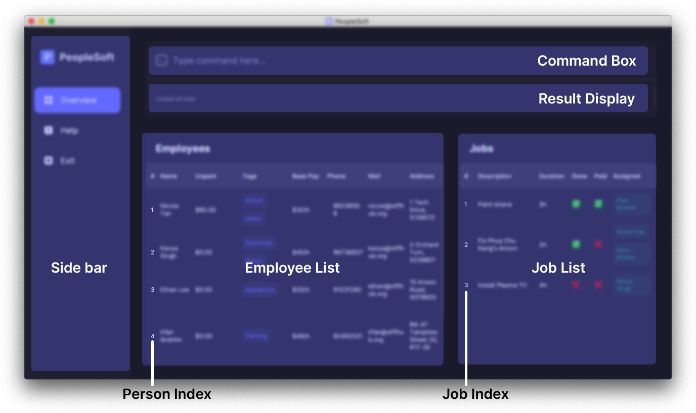 

<figcaption 
    style="text-align: center; 
           font-style: italic;">
    The PeopleSoft interface
</figcaption>

When PeopleSoft is started for the first time, it will be populated with sample data. You may delete this data with the `clear` command.

A `data` folder and some configuration files (with a `.json` extension) will also be created in the folder that you run `peoplesoft.jar` from; this is where PeopleSoft data will be stored.

[//]: # (Comment: trying this out, will remove if it doesnt work on webpage after I merge)
[Return to the Table of Contents](#toc)

### Processing your first payment using the sample data

The sample data is meant to help users get started with PeopleSoft. This is a tutorial of some of the basic features of PeopleSoft using the sample data. As such, it is not a comprehensive overview of every feature in PeopleSoft. You can refer to the [features](#features) section for more information about specific features.

To start off, notice that the sample data contains some employees under the list of employees. Here, you can see the details of the employees, including their name, base pay and tags.

Since the sample data does not include any jobs, we will need to create new ones.

#### Create a job

When your company receives a new job, you can add it to PeopleSoft. To create a job, you can use the `add` command. You will have to specify a name and duration using the `n/` and `d/` prefixes respectively. For this tutorial, we will create a 2-hour-long aircon repair job.

1. Type `add n/Repair aircon d/2` in the command window.

    This command will add a new job with the name "Repair aircon" and a duration of two hours.

    

    **:information_source: Note:** The attributes prefixed by `n/` and `d/` can be in any order.

    

2. Hit **Enter** to run the command.

    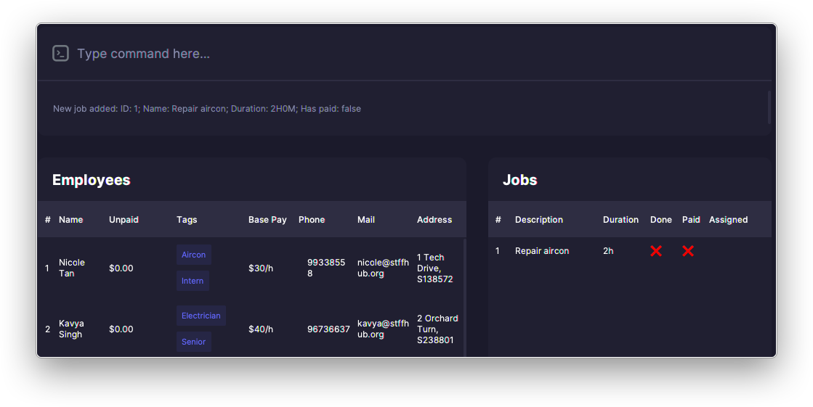

    <figcaption 
        style="text-align: center; 
               font-style: italic;"> 
        A job with the name "Repair aircon" and a duration of two hours is created in the job list
    </figcaption>
 

#### Assign employee to a job

PeopleSoft allows you to indicate which employees are in-charge of a certain job with the `assign` command. The `assign` command requires 1 job *index*, and at least 1 employee *index* (each prefixed by `i/`). These indexes can be found under the `#` column in both lists.

1. Type `assign 1 i/1` in the command window.

    The first number in the command (`1`) refers to the *index* of the job. In this case, it refers to the first job in the list of jobs, which is the aircon repair job created earlier.

    The prefix `i/` denotes the index of the employee to be assigned to the job. In this case, it references the first employee in the list of employees, which is "Nicole Tan". Additional employees can also be assigned to this job by adding additional `i/` attributes.

2. Hit **Enter** to run the command.

    A message should appear, indicating that the job "Repair aircon" is assigned to "Nicole Tan".

    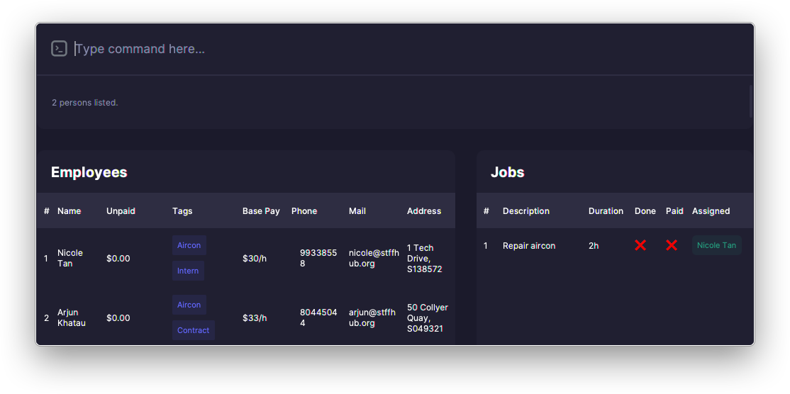

    <figcaption 
        style="text-align: center; 
               font-style: italic;"> 
        Nicole Tan is assigned to the "Repair aircon" job
    </figcaption>
 

**:information_source: Note:** Index-based commands depend on the ordering of the items displayed in their respective lists. The search and list commands for employees and jobs can cause this order to vary.

 

#### Find employees who are qualified

1. Type `personfind aircon` in the command window.

    This command searches for "aircon" in the names or tags of employees. Search terms are not case-sensitive.

2. Hit **Enter** to run the command.

    There should be two employees listed: "Nicole Tan", and "Arjun Khatau". Notice that the list of employees now only shows employees with the "Aircon" tag.

   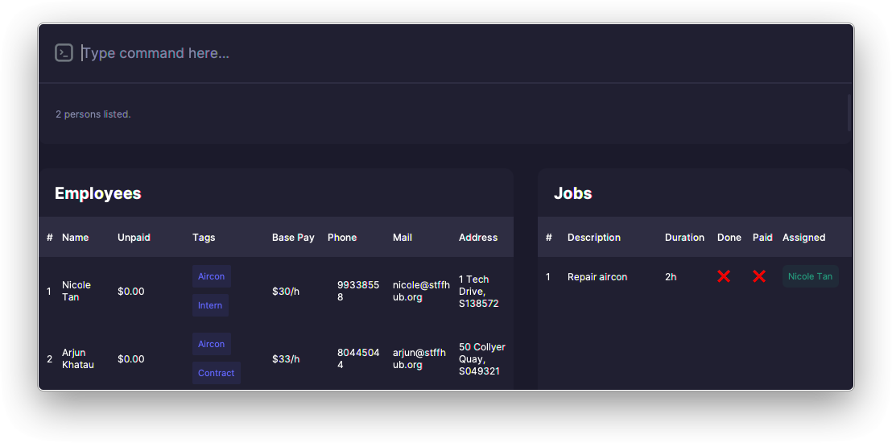

    <figcaption 
        style="text-align: center; 
               font-style: italic;"> 
        Nicole and Arjun are have the "Aircon" tag
    </figcaption>
 

3. Type `assign 1 i/2` in the command window.

    This assigns the second employee in the list (Arjun Khatau) to the first job. Notice that the employee index (2) now refers to the second employee in the current list (Arjun Khatau), instead of in the original list (Kavya Singh).

4. Hit **Enter** to run the command.

    A message should appear, indicating that the job "Repair aircon" is assigned to "Arjun Khatau".

#### Complete a job and pay employees

A key feature of PeopleSoft is tracking the state of job completion and whether its payment has been processed; this can be done with the `mark` and `pay` commands, respectively.

1. Type `mark 1` in the command window.

    This command marks the first job as completed.

2. Hit **Enter** to run the command.

    The job "Repair aircon" should be marked as completed, and a checkmark  should appear under the *Done* column.

Marking a job as completed creates pending payments for the job. The amounts pending payment are reflected in the *Unpaid* column in the employees list.

Now that the "Repair aircon" job has been marked as completed, "Nicole Tan" and "Arjun Khatau" should have non-zero values under the *Unpaid* column.

This value reflects the amount of money that is pending payment to the employees. It is calculated from the employee's base rate and the job's duration.

1. Type `pay 1 y/` in the command window. 

    The prefix `y/` is a safeguard against accidental misuse of this command. This command finalizes payments for the given job, and is **irreversible**. After the job is finalized, it cannot be further modified, so do make sure that you intend to run this command before running it.

2. Hit **Enter** to run the command.

    The payments for the job is now finalized, indicating that the employees have been paid for the job. This is also reflected in the checkmark  under the *Paid* column.

   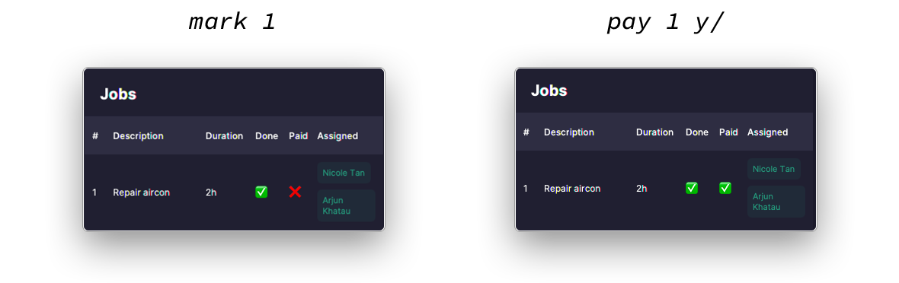

    <figcaption 
        style="text-align: center; 
               font-style: italic;"> 
        The job list after the job is marked as done and payments are finalised
    </figcaption>
 

#### Export employee payslips

PeopleSoft also allows users to export a payslip for each employee as a comma-separated values (CSV) spreadsheet.

1. Type `export 1` in the command window.

    This command exports the payslip for the first employee (Nicole Tan) to a CSV spreadsheet.

2. Hit **Enter** to run the command.

    The payslip beginning with the employee's name is now saved in the PeopleSoft `data` folder.

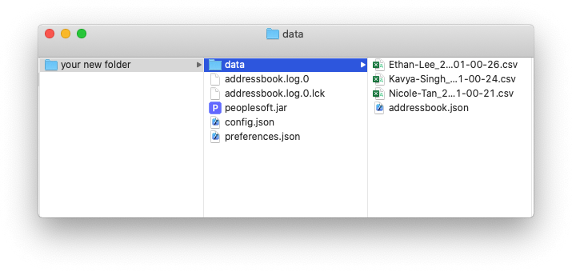

<figcaption 
    style="text-align: center; 
           font-style: italic;"> 
    Exported employee data can be found under the data folder
</figcaption>

This concludes the tutorial on the basic usage of PeopleSoft. You can refer to the [features](#features) section for more information about specific features. To clear the sample data, run the `clear` command.

[Return to the Table of Contents](#toc)

--------------------------------------------------------------------------------------------------------------------
## Command summary

A handy reference for more experienced users who just need to know the format of a command.

| Command                                                     | Format                                                                                          | Examples                                                                                                      |
|:------------------------------------------------------------|:------------------------------------------------------------------------------------------------|:--------------------------------------------------------------------------------------------------------------|
| [`personadd`](#personadd-add-an-employee)                   | `personadd n/NAME p/PHONE_NUMBER e/EMAIL a/ADDRESS r/RATE [t/TAG]...​`                           | `personadd n/Nicole Tan p/99338558 e/nicole@stffhub.org  a/1 Tech Drive, S138572 r/37.50 t/Hardware t/Senior` |
| [`personedit`](#personedit-edit-an-employees-information)   | `personedit EMPLOYEE_INDEX [n/NAME] [p/PHONE_NUMBER] [e/EMAIL] [a/ADDRESS] [r/RATE] [t/TAG]...​` | `personedit 2 n/Nicole Lee t/OS`                                                                              |
| [`persondelete`](#persondelete-delete-an-employee)          | `persondelete EMPLOYEE_INDEX`                                                                   | `persondelete 3`                                                                                              |
| [`personfind`](#personfind-find-employees-by-name-or-tag)   | `personfind KEYWORD [KEYWORD]...​`                                                               | `personfind Nicole Hardware`, `personfind Aircon`                                                             |
| [`personlist`](#personlist-list-all-employees)              | `personlist`                                                                                    | NA                                                                                                            |
| [`export`](#export-export-jobs-done-by-an-employee)         | `export EMPLOYEE_INDEX`                                                                         | `export 2`                                                                                                    |
| [`clear`](#clear-clear-all-peoplesoft-data)                 | `clear`                                                                                         | NA                                                                                                            |
| [`add`](#add-add-a-job)                                     | `add n/NAME d/DURATION`                                                                         | `add n/Fix HDB Lock d/1`                                                                                      |
| [`find`](#find-find-jobs-by-name)                           | `find KEYWORD [KEYWORD]...`                                                                     | `find Painting Senior`, `find Painting`                                                                       |
| [`list`](#list-list-all-jobs)                               | `list`                                                                                          | NA                                                                                                            |
| [`delete`](#delete-delete-a-job)                            | `delete JOB_INDEX`                                                                              | `delete 3`                                                                                                    |
| [`assign`](#assign-assign-a-job-to-an-employee)             | `assign JOB_INDEX i/EMPLOYEE_INDEX [i/EMPLOYEE_INDEX]...​`                                       | `assign 2 i/1`                                                                                                |
| [`mark`](#mark-mark-or-unmark-a-job-as-done)                | `mark JOB_INDEX`                                                                                | `mark 2`                                                                                                      |
| [`pay`](#pay-finalize-payments-for-a-job)                   | `pay JOB_INDEX y/`                                                                              | `pay 2 y/`                                                                                                    |
| [`exit`](#exit-exit-peoplesoft)                             | `exit`                                                                                          | NA                                                                                                            |
| [`help`](#help-show-help-page)                              | `help`                                                                                          | NA                                                                                                            |

<figcaption 
    style="text-align: center; 
           font-style: italic;"> 
    Parts of a command in PeopleSoft
</figcaption>

**:information_source: Notes about the command format:** 

* Words in `UPPERCASE` are the attributes to be replaced with values provided by you. 
  e.g. in `personadd n/NAME`, `NAME` can be replaced with an actual name like in `personadd n/John Doe`.

* Attributes can be in any order. 
  e.g. if the command asks for `n/NAME p/PHONE_NUMBER`, `p/PHONE_NUMBER n/NAME` is also fine.

* If an attribute is expected only once but is used multiple times, only the last occurrence of the attribute will be taken. 
  e.g. if you specify `n/Jake n/Jason`, only `n/Jason` will be taken.

* For commands that do not need attributes (like `help`, `list`, `exit` and `clear`), anything typed after the command word will be ignored. 
  e.g. `help 123` will be interpreted as `help`.

* Items in square brackets are optional. 
  e.g. `n/NAME [t/TAG]` can be specified as `n/John Doe t/friend` or `n/John Doe`.

* Items with ellipses (`...​`) after them indicate that the items can be repeated any number of times. 
  e.g. `[t/TAG]...​` can be interpreted as `[t/TAG]`, `[t/TAG] [t/TAG]`, and so on.

### Parameter constraints

A handy reference for the constraints on input parameters for commands.

<table>
  <tbody>
    <tr>
      <th>Parameter</th>
      <th>Prefix</th>
      <th>Constraints</th>
    </tr>
    <tr>
      <td>Name</td>
      <td><code>n/</code></td>
      <td>
        
Contains only alphanumeric characters and spaces.

        
Should not be empty.

      </td>
    </tr>
    <tr>
      <td>Phone number</td>
      <td><code>p/</code></td>
      <td>
        
Contains only numbers.
 
        
Should be at least three digits long.

      </td>
    </tr>
    <tr>
      <td>Email</td>
      <td><code>e/</code></td>
      <td>
        
Should be of the format `name@domain.com` where:

        <ol>
          <li><code>name</code> contains only alphanumeric characters and the following special characters: <code>+_.-</code></li>
          <li><code>name</code> should start and end with alphanumeric characters</li>
          <li><code>domain</code> contains only alphanumeric characters and the following special characters: <code>.-</code></li>
          <li><code>domain</code> should be at least two characters long</li>
          <li><code>domain</code> should start and end with alphanumeric characters</li>
          <li><code>domain</code> should not contain any two consecutive special characters</li>
        </ol>
      </td>
    </tr>
    <tr>
      <td>Address</td>
      <td><code>a/</code></td>
      <td>
        
Should not be empty.

      </td>
    </tr>
    <tr>
      <td>Rate</td>
      <td><code>r/</code></td>
      <td>
        
Should be a number consisting of only digits `0-9` and an optional decimal point.

        
Should not be negative.

        
Should not have more than two decimal places.

        
Should not be larger than `1000000` (one million).

      </td>
    </tr>
    <tr>
      <td>Tag</td>
      <td><code>t/</code></td>
      <td>
        
Contains only alphanumeric characters.

        
Should not be empty.

      </td>
    </tr>
    <tr>
      <td>Duration</td>
      <td><code>d/</code></td>
      <td>
        
Should be a number consisting of only digits `0-9` and an optional decimal point.

        
Should be positive.

        
Should not be larger than `23.99`. Consider splitting the job into multiple smaller jobs if a larger value is desired.

        
Should not be empty.

      </td>
    </tr>
    <tr>
      <td>Employee to assign</td>
      <td><code>i/</code></td>
      <td>
        
Contains only digits <code>0-9</code>.

        
Should be a valid index of an employee in the employee list.

        
Should not be empty.

      </td>
    </tr>
    <tr>
      <td>JOB_INDEX</td>
      <td>N.A.</td>
      <td>
        
Contains only digits <code>0-9</code>.

        
Should be a valid index of a job in the job list.

        
Should not be empty.

      </td>
    </tr>
    <tr>
      <td>EMPLOYEE_INDEX</td>
      <td>N.A.</td>
      <td>
        
Contains only digits <code>0-9</code>.

        
Should be a valid index of an employee in the employee list.

        
Should not be empty.

      </td>
    </tr>
  </tbody>
</table>

[Return to the Table of Contents](#toc)

--------------------------------------------------------------------------------------------------------------------

## Features

### Employee-related commands

#### `personadd`: Add an employee

Adds a new employee to the system with the given attributes.

Rate refers to the hourly pay of the employee.

Format: `personadd n/NAME p/PHONE_NUMBER e/EMAIL a/ADDRESS r/RATE [t/TAG]...`

Examples:

* `personadd n/Nicole Tan p/99338558 e/nicole@stffhub.org a/1 Tech Drive, S138572 r/37.50 t/Hardware t/Senior` will create a new employee with name "Nicole Tan", phone number "99338558", email "nicole@stffhub.org", address "1 Tech Drive, S138572", an hourly rate of $37.50, and with tags "Hardware" and "Senior".
* `personadd n/Jennifer Tan p/88473219 e/jennifer@stffhub.org a/13 Tech Drive, S182562 r/25` will create a new employee with name "Jennifer Tan", phone number "88473219", email "jennifer@stffhub.org", address "13 Tech Drive, S182562", an hourly rate of $25. No tags will be added since no tag attributes were provided.

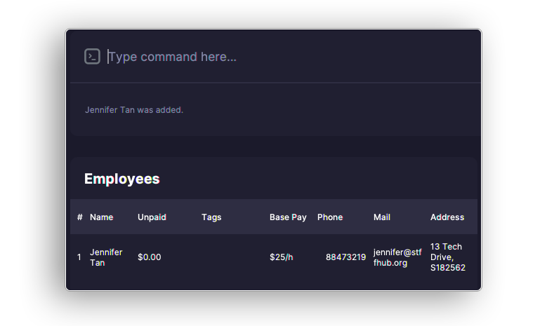

<figcaption 
    style="text-align: center; 
           font-style: italic;">
    After adding Jennifer Tan to PeopleSoft
</figcaption>

**:information_source: Note:** 

* Attributes containing `/` are not accepted. Replace `/` with another character (e.g. `-`) if any attribute contains `/`.

  For example: Use `Ravi s-o Veegan` instead of `Ravi s/o Veegan`, and `3-5 Jalan Trus` instead of `3/5 Jalan Trus`.

* The maximum value for the hourly rate of an employee is $1,000,000.

[Return to the Table of Contents](#toc)

#### `personedit`: Edit an employee's information

Edit the information of an existing employee. Use this in the event that an employee's details change.

Rate updates will only take effect with jobs that are pending completion; payout amounts for already-completed (i.e. marked with `mark`) jobs will not change.

Format: `personedit EMPLOYEE_INDEX [n/NAME] [p/PHONE_NUMBER] [e/EMAIL] [a/ADDRESS] [r/RATE] [t/TAG]...​`

Examples:

* `personedit 2 p/62353535` changes the second employee's phone number to 62353535.
* `personedit 3 t/Hardware t/Network` changes the third employee's tags to "Hardware" and "Network" instead of their original tags.

**:information_source: Note:** 

* Attributes containing `/` are not accepted. Replace `/` with another character (e.g. `-`) if any attribute contains `/`.

  For example: Use `Ravi s-o Veegan` instead of `Ravi s/o Veegan`, and `3-5 Jalan Trus` instead of `3/5 Jalan Trus`.

* The maximum value for the hourly rate of an employee is $1,000,000.

* When editing tags, new tags will **not** be added to the existing tags. Instead, all existing tags will be replaced by new tags.

* To clear all tags, add `t/` to the command without specifying any other tags.

[Return to the Table of Contents](#toc)

#### `persondelete`: Delete an employee

Deletes the employee referred to by the index. This also removes the deleted employee from all associated jobs. 

**:warning: Caution:** 

This is irreversible.

Format: `persondelete EMPLOYEE_INDEX`

Example: `persondelete 3` deletes the third employee in the list.

[Return to the Table of Contents](#toc)

#### `personfind`: Find employees by name or tag

Finds all employees that have the given keyword(s) in their names or tags, and lists them in the employee list.

If multiple keywords are entered, only entries that match **all** keywords are returned.

Keywords are case-insensitive.

Format: `personfind KEYWORD [KEYWORDS]...​`

Examples:

* `personfind Nicole Hardware` finds all employees with "Nicole" **and** "Hardware" in their name and/or tags.
* `personfind Nicole` finds all employees with "Nicole" in their name and/or tags.
* `personfind Nicole Hardware Display` finds all employees with "Nicole", "Hardware", **and** "Display" in their name and/or tags.

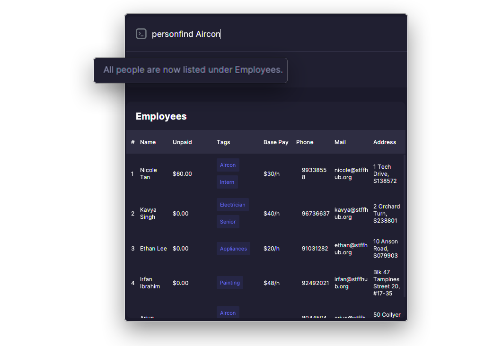

<figcaption style="text-align: center; font-style: italic;">Before the command is executed: all employees are shown.</figcaption>

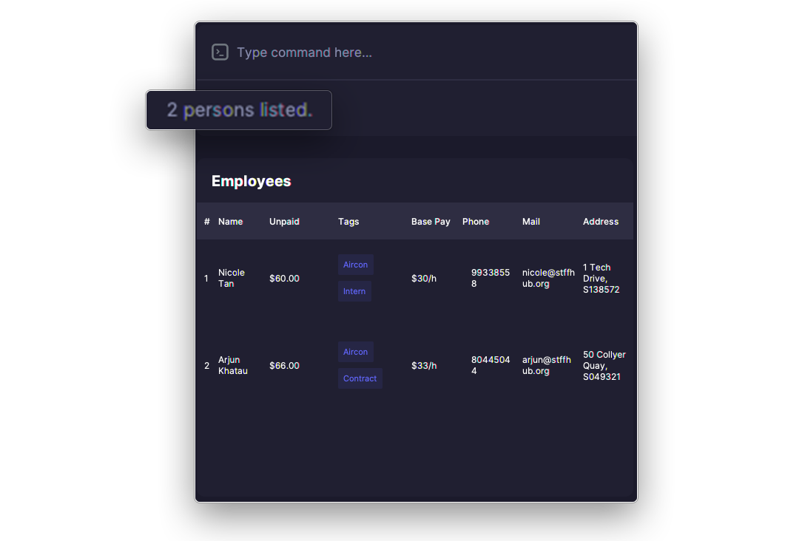

<figcaption style="text-align: center; font-style: italic;">After the command is executed: Employees with the "Aircon" tag are shown.</figcaption>

[Return to the Table of Contents](#toc)

#### `personlist`: List all employees

Lists all employees added to PeopleSoft.

Format: `personlist`

Example: `personlist` shows all employees.

[Return to the Table of Contents](#toc)

#### `export`: Export jobs done by an employee

Exports a `.csv` file to the `data` folder, containing the jobs that the employee was assigned to, including:
* job IDs,
* job descriptions,
* job statuses (incomplete, pending payment, paid),
* effective rate(s) for the employee,
* job durations, and
* the amount paid, or to be paid to the employee.

Format: `export EMPLOYEE_INDEX`

Example: `export 3` exports the third employee in the list.

**:information_source: Note:** 

This command updates the job list to show all jobs assigned to that employee.

[Return to the Table of Contents](#toc)

--------------------------------------------------------------------------------------------------------------------

### Job-related commands

#### `add`: Add a job

Adds a new job with the given attributes. `DURATION` refers to the duration required for the job, in hours.

Format: `add n/NAME d/DURATION`

Examples:

* `add n/Fix HDB Lock d/1` creates a job named "Fix HDB Lock" with a duration of 1 hour.
* `add n/Repair aircon d/4` creates a job named "Repair aircon" with a duration of 4 hours.

**:information_source: Note:** 

* The maximum value for the duration of a job is 1,000,000 hours.

* Multiple jobs of the same name can be added. These jobs can then be differentiated by their internal ID, the order in which they were added, and/or the employees that were assigned to it, although it can easily result in confusion. It is thus recommended that a user differentiates jobs through naming to avoid any confusion.

[Return to the Table of Contents](#toc)

#### `find`: Find jobs by name

Finds all jobs that have the given keyword(s) in their names, and lists them in the employee list.

If multiple keywords are entered, only entries that match **all** keywords are returned.

Keywords are case-insensitive.

Format: `find KEYWORD [KEYWORD]...`

Examples:

* `find paint` finds all jobs with "paint" in their names.
* `find paint istana` finds all jobs with "paint" **and** "istana" in their names.

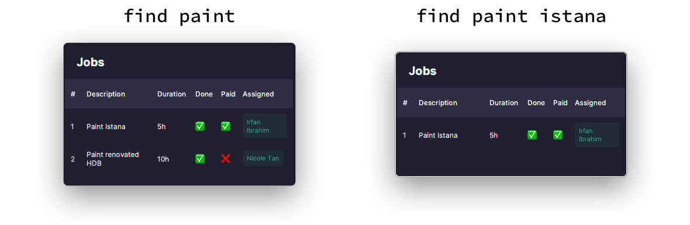

<figcaption 
    style="text-align: center; 
           font-style: italic;">
    Entries that match all keywords are found
</figcaption>

[Return to the Table of Contents](#toc)

#### `list`: List all jobs

Lists all jobs added to PeopleSoft.

Format: `list`

Example: `list` shows all jobs.

[Return to the Table of Contents](#toc)

#### `delete`: Delete a job

Deletes the job with the given index.

**:warning: Caution:** 

This is irreversible.

Format: `delete JOB_INDEX`

Example: `delete 2` deletes the second job.

[Return to the Table of Contents](#toc)

#### `assign`: Assign a job to an employee

Assigns a job to an employee to indicate that they are to be paid for the job.

Format: `assign JOB_INDEX i/EMPLOYEE_INDEX [i/EMPLOYEE_INDEX]...`

Examples:

* `assign 2 i/3` assigns the second job to the third employee.
* `assign 1 i/5 i/7` assigns the first job to the fifth and seventh employees.

**:information_source: Note:** 

A job that has been [marked](#mark-mark-or-unmark-a-job-as-done) as completed cannot be assigned. If a job is completed, it makes little sense to assign more employees to it. In the event more employees need to be assigned to a job, unmark the job first before assigning them.

<figcaption 
    style="text-align: center; 
           font-style: italic;">
    Assigning the 4th job in the job list to Kavya, the first employee in the employees list
</figcaption>

[Return to the Table of Contents](#toc)

#### `mark`: Mark or unmark a job as done

Marks a job as done if it was not already marked as done, or marks a job as undone otherwise.

Marking a job as done indicates that a job has been completed and is pending payment. Unmarking a job causes the pending payment amounts to be subtracted from assigned employees.

Jobs are initially **not** marked as done when first created, and have to have at least one employee [assigned](#assign-assign-a-job-to-an-employee) to it before it can be marked.

**:information_source: Note:** 

The hourly rate(s) paid out to each employee for a job is fixed once the job is marked as done; further changes to any employee's rate will not cause the payout amounts to change.

To update the payout amounts to reflect the new hourly rates, unmark and mark the job again.

Format: `mark JOB_INDEX`

Examples:

* `mark 1` marks the first job, assuming it is not already marked as done.
* `mark 1` unmarks the first job if it has already been marked as done.

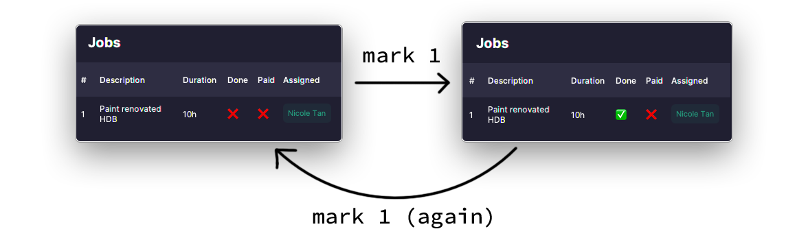

<figcaption 
    style="text-align: center; 
           font-style: italic;">
    You can use the mark command to both mark and unmark a job
</figcaption>

[Return to the Table of Contents](#toc)

#### `pay`: Finalize payments for a job

Finalizes the payments of a job. A job needs to be [marked](#mark-mark-or-unmark-a-job-as-done) as done before it can be finalized.

**:warning: Caution:** 

This is irreversible. The finalized job cannot be modified in any way, and can only be removed with [`clear`](#clear-clear-all-peoplesoft-data).

Format: `pay JOB_INDEX y/`

Example: `pay 2 y/` finalizes the payments of the second job

<figcaption 
    style="text-align: center; 
           font-style: italic;">
    Before paying for the second job
</figcaption>

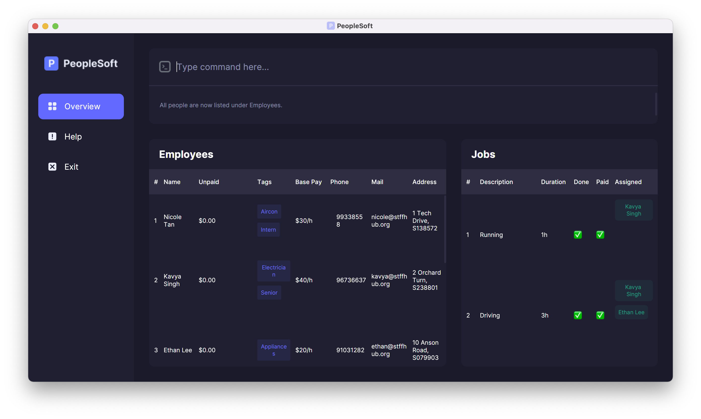

<figcaption 
    style="text-align: center; 
           font-style: italic;">
    After paying for the second job
</figcaption>

[Return to the Table of Contents](#toc)

--------------------------------------------------------------------------------------------------------------------

### Miscellaneous commands

#### `clear`: Clear all PeopleSoft data

Removes **all** data stored in PeopleSoft. Useful for removing the sample data created when PeopleSoft is started for the first time.

**:warning: Caution:** 

This is irreversible; deleted data cannot be recovered afterwards without a backup.

Format: `clear`

Example: `clear` removes all employees and jobs from PeopleSoft.

[Return to the Table of Contents](#toc)

#### `exit`: Exit PeopleSoft

Exits PeopleSoft immediately.

Format: `exit`

Example: `exit` exits PeopleSoft immediately.

[Return to the Table of Contents](#toc)

#### `help`: Show help page

Opens the help page, which includes a list of commands, command formats, and example usages.

Format: `help`

Example: `help` opens up the help page.

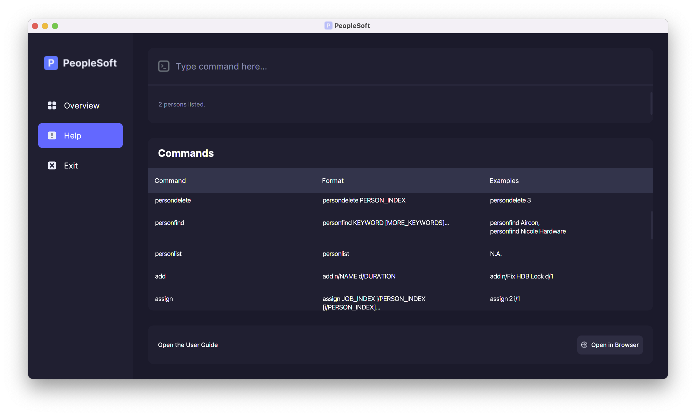

<figcaption 
    style="text-align: center; 
           font-style: italic;">
    The help page
</figcaption>

[Return to the Table of Contents](#toc)

--------------------------------------------------------------------------------------------------------------------

## FAQ

**Q**: I'm using macOS and I can't double-click on the `peoplesoft.jar` file to open it. What should I do? 

**A**: Follow the steps [here](https://github.com/nus-cs2103-AY2122S1/forum/issues/353) to open your `jar` file.

 

**Q**: What are the `addressbook.log.0`, `config.json`, `preferences.json` files in the same folder as `peoplesoft.jar`? 

**A**: PeopleSoft uses the settings inside those files to run. For instance, the height and width of PeopleSoft is stored in those files. Do not remove or edit those files.

 

**Q**: How do I save my data?

**A**: PeopleSoft automatically saves application data to the folder that it was started from after every command. There is no need to save manually.

 

**Q**: How can I edit PeopleSoft data manually?

**A**: PeopleSoft data is saved as a JSON file under `data/peoplesoft.json` in the folder that it was started from. It is possible (although not recommended) to modify application data by editing that file.

**:warning: Caution:** 

Do not edit the data directly unless you know what you are doing. If your changes cause the data file to become invalid, PeopleSoft will discard all data and start with an empty data file the next time it is started.

 

**Q**: Can I get back the initial sample data?

**A**: Deleting the `data/peoplesoft.json` file and restarting PeopleSoft will cause the sample data to be reloaded.

 

**Q**: How do I transfer my data to another computer?

**A**: Install PeopleSoft on the other computer and overwrite the `data/peoplesoft.json` file it creates with your existing `data/peoplesoft.json` file.

 

**Q**: How do I report a bug? How do I suggest a feature?

**A**: You may report a bug or suggest a new feature on the [PeopleSoft issue tracker](https://github.com/AY2122S2-CS2103T-T11-4/tp/issues).

[Return to the Table of Contents](#toc)

--------------------------------------------------------------------------------------------------------------------

## Glossary

**CLI**: Command-line interface. A primarily text-based interface, which is typically operated with text commands.

**CSV**: Comma-separated values. A common file format for storing tabular data, similar to a spreadsheet.

**GUI**: Graphical user interface. A primarily visual interface, which is typically operated by a pointing device. 

**Index**: The item's number that is displayed in its respective list.

e.g. The second employee in the list has an `INDEX` of 2.

**JAR**: Java ARchive. A file format used to collate Java class files and their resources for distribution. Java applications are commonly distributed as `.jar` files.

**JSON**: JavaScript Object Notation. A structured file format used to store arbitrary text data. This is the file format used by PeopleSoft to store data and settings.

**Keyword**: A word to search for in a set of data, e.g. in the list of employees or jobs.

[Return to the Table of Contents](#toc)
