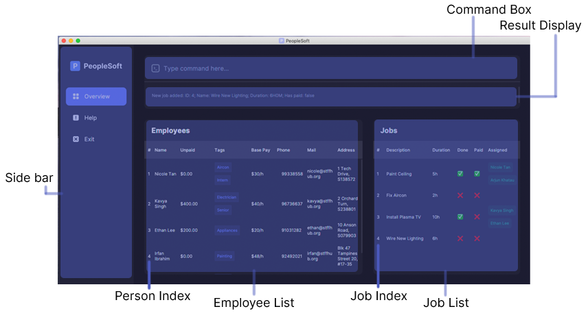
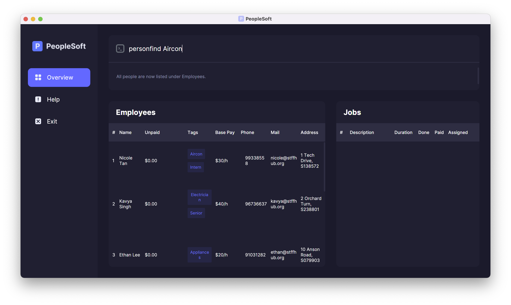
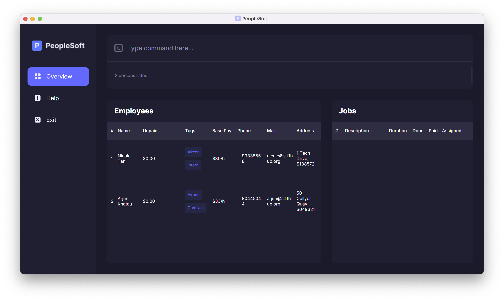
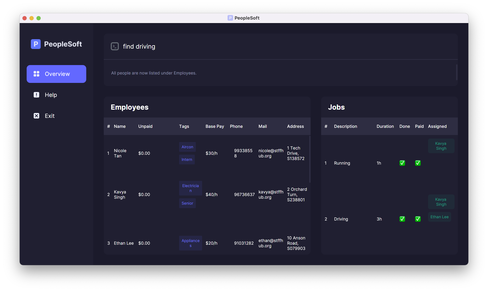
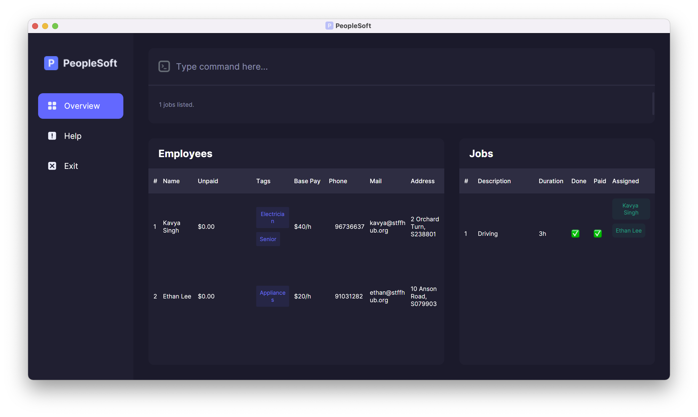
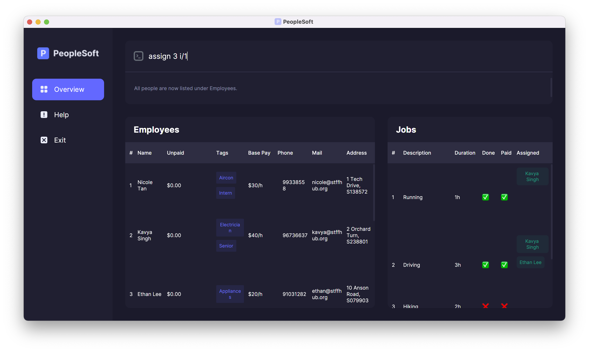
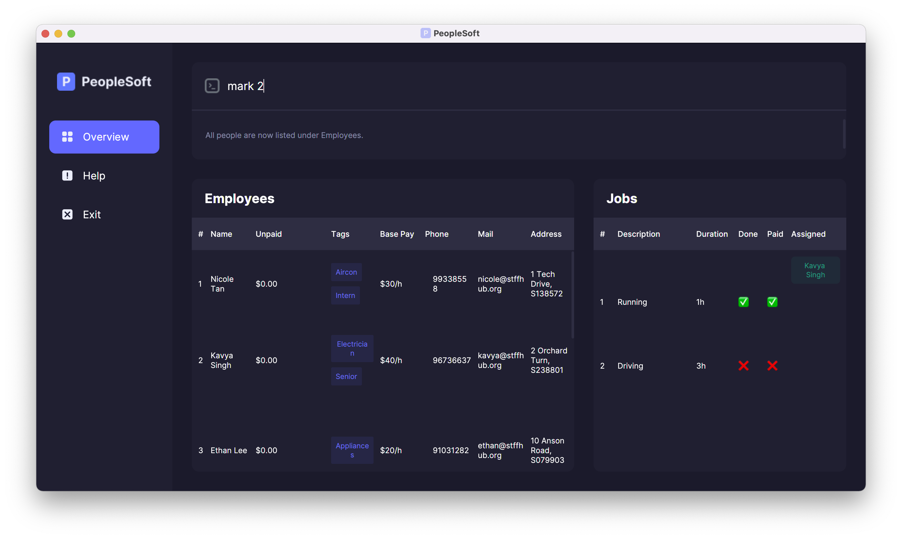
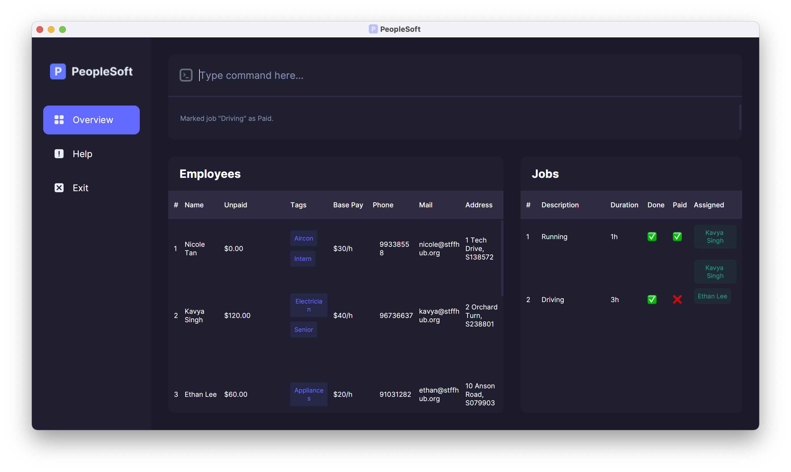

Welcome to PeopleSoft!

PeopleSoft is a desktop app for **calculating the salary for shift-based contractors**, optimized for use via a **Command Line Interface (CLI)**. If you are a **HR manager** and you can type fast, PeopleSoft can get your payroll tasks done **much faster** than traditional GUI apps.

You can input your employees' data and the jobs that you want to keep track of.
Then, you can assign the employees to the jobs that they are working on.
After the job is completed, you can mark the job as paid, and PeopleSoft will calculate how much each employee is to be paid based on their hourly rates.
You can also generate a payslip in comma-separated values (CSV) format for you and your employees to refer to.

The program simulates a real life workflow:
  * Company receives a new job.
  * The HR manager `add`s the job to PeopleSoft, and `assign`s employees to work on it.
  * Employees start working. 
  * When the employees complete the job, the HR manager `mark`s the job as completed.
  * Once it is time to pay the employees, `pay` out the job and `export` the payslips for the employees.

**:information_source: How to use this guide:** 

* Words in `monospace font` are commands to be typed into PeopleSoft. 

* Words in `UPPERCASE` are to be replaced with an appropriate value. 
  e.g. `n/NAME` means that `NAME` should be substituted with a name, e.g. `n/John Doe`.

* Words in square brackets are optional. 
  e.g. `n/NAME [t/TAG]` can be used as `n/John Doe t/friend` or as `n/John Doe`.

--------------------------------------------------------------------------------------------------------------------
* Table of Contents 
{:toc}
--------------------------------------------------------------------------------------------------------------------

## Quick start

### Running PeopleSoft for the first time

1. Ensure you have Java 11 or above installed on your computer. Follow [**this guide**](https://docs.oracle.com/en/java/javase/11/install/overview-jdk-installation.html#GUID-8677A77F-231A-40F7-98B9-1FD0B48C346A) to do so.

2. **Download** the latest version of `peoplesoft.jar` from [**here**](https://github.com/AY2122S2-CS2103T-T11-4/tp/releases).

3. Place the `peoplesoft.jar` file anywhere on your computer (preferably within a new folder, as the configuration and data files will be stored in the same location).

4. **Double-click** the file to start the app. A window (similar to the one below) should appear shortly.

**:information_source: Note:** If double-clicking the file does not start the application, then open the command line interpreter for your system (e.g. Command Prompt or Windows Terminal for Windows, or Terminal on macOS and Linux), navigate to directory where the file is located (e,g, with `cd path/to/folder`), and run `java -jar peoplesoft.jar`.

 
_The PeopleSoft interface_

The application should be filled with sample data. Additionally, the application should have created a `data` folder and some additional files in the same folder as `peoplesoft.jar`. Use the `clear` command to delete the sample data.

### Exploring the sample data

The sample data is meant to help users get started using PeopleSoft. This is a tutorial of some of the basic features of PeopleSoft using the sample data. As such, it is not a comprehensive overview of every feature in the application. You can refer to the [features](#features) section for more information about specific features. 

To start off, notice that the sample data contains some employees under the table of employees. Here you can see the details of the employees, including their name, base pay and tags. Notice also that the sample data does not contain any jobs.

#### Create a job

When employees start working on a job, you can add it to PeopleSoft. To create a job, you can use the command `add`. You will have to specify a name and a duration using the prefixes `n/` and `d/` respectively. In this case, a aircon repair job that lasts two hours will be created.

1. Type `add n/Repair aircon d/2` in the command window.

This is the command to add a new job with the name 'Repair aircon' and a duration of two hours.

**:information_source: Note:** The order of the prefixes `n/` and `d/` does not matter.

2. Hit **enter** to run the command.

A new job should be created in the table of jobs. It should have the name 'Repair aircon' with a duration of '2h'.

#### Assign person to a job

Like in the real-world, jobs need to be assigned to employees. This can be done in PeopleSoft with the command `assign`. `assign` is a command that is **index-based**, this means that it uses the ordering of the items displayed in the table. You will have to specify at least two indexes, one for the job, and at least one for the employees.

1. Type `assign 1 i/1` in the command window.

The first number in the command refers to the index of the job in the table of jobs. In this case, it references the first job in the table of jobs, which is the aircon repair job created earlier. The prefix `i/` denotes the index of the employee to be assigned to the job. In this case, it references the first employee in the table of employees, which is 'Nicole Tan'.

2. Hit **enter** to run the command.

A message should appear that mentions that the job 'Repair aircon' is assigned to 'Nicole Tan'. 

Index-based commands depend on the ordering of the items displayed in its respective table. The respective search and list commands can vary this order to the user's liking.'

3. Type `personfind aircon` in the command window.

This command searches through the table of employees to find any keywords that match with 'Aircon'. Keywords can be part of names or tags and are not case-sensitive.

4. Hit **enter** to run the command.

There should be two persons listed. One of whom is 'Nicole Tan', and the other is 'Arjun Khatau'. Notice how the table of employees have been updated to where each person has the 'Aircon' tag.

5. Type `assign 1 i/2` in the command window.

This assigns the second person in the table to the first job, which is 'Arjun Khatau' Notice how the index being used is that of the new filtered table where 'Arjun Khatau' is the second employee that is listed.

6. Hit **enter** to run the command.

A message should appear that mentions that the job 'Repair aircon' is assigned to 'Arjun Khatau'.

#### Complete a job and pay employees

A key feature of PeopleSoft is tracking the state of job completion and whether its payment has been processed. Two commands, `mark` and `pay` are suited for these roles respectively. Both `mark` and `pay` are index-based commands.

1. Type `mark 1` in the command window.

This command marks the first job as completed.

2. Hit **enter** to run the command.

The job 'Repair aircon' should be marked as completed. This can also be seen through the checkmark under the *Done* column.

3. Type `personlist` in the command window. Hit **enter** to run the command. This reverts the employee table to display **all** employees.

Marking a job as completed creates pending payments for the job. The pending payments are reflected in the *Unpaid* column in the employees list. Notice how 'Nicole Tan' and 'Arjun Khatau' have non-zero values under the *Unpaid* column.
This value reflects the amount of money that is pending payment to the employees. It is calculated from the employee's base rate and the job's duration.

4. Type `pay 1 y/` in the command window. 

The prefix `y/` is a safeguard against accidental misuse of this command. This command finalizes payments for the given job and it is **irreversible**. After the job is finalized, it cannot be modified by any commands, so do make sure that you are intending to run this command before running it.
   
5. Hit **enter** to run the command.

The job has its payments finalized, i.e. it has been sent to the bank for processing. This is reflected in the checkmark under the *Paid* column.

**:information_source: Note:** Run the `export` command to create a CSV payslip for an employee.

This concludes the short tutorial on the basic functionalities of PeopleSoft. You can refer to the [features](#features) section for more information about specific features. To clear the sample data, run the command `clear`.

--------------------------------------------------------------------------------------------------------------------
## Command summary

A handy reference for more experienced users who just need to know the format of a command.

| Command        | Format                                                                                            | Examples                                                                                                      |
|:---------------|:--------------------------------------------------------------------------------------------------|:--------------------------------------------------------------------------------------------------------------|
| `personadd`    | `personadd n/NAME p/PHONE_NUMBER e/EMAIL a/ADDRESS r/RATE [t/TAG]...​`                         | `personadd n/Nicole Tan p/99338558 e/nicole@stffhub.org  a/1 Tech Drive, S138572 r/37.50 t/Hardware t/Senior` |
| `personedit`   | `personedit PERSON_INDEX [n/NAME] [p/PHONE_NUMBER] [e/EMAIL] [a/ADDRESS] [r/RATE] [t/TAG]...​` | `personedit 2 n/Nicole Lee t/OS`                                                                              |
| `persondelete` | `persondelete PERSON_INDEX`                                                                       | `persondelete 3`                                                                                              |
| `personfind`   | `personfind KEYWORD [MORE_KEYWORDS]...​`                                                       | `personfind Nicole Hardware`, `personfind Aircon`                                                             |
| `personlist`   | `personlist`                                                                                      | NA                                                                                                            |
| `export`       | `export PERSON_INDEX`                                                                             | `export 2`                                                                                                    |
| `clear`        | `clear`                                                                                           | NA                                                                                                            |
| `add`          | `add n/NAME d/DURATION`                                                                           | `add n/Fix HDB Lock d/1`                                                                                      |
| `find`         | `find NAME`                                                                                       | `find Painting`                                                                                               |
| `list`         | `list`                                                                                            | NA                                                                                                            |
| `delete`       | `delete JOB_INDEX`                                                                                | `delete 3`                                                                                                    |
| `assign`       | `assign JOB_INDEX i/PERSON_INDEX [i/PERSON_INDEX]...​`                                         | `assign 2 i/1`                                                                                                |
| `mark`         | `mark JOB_INDEX`                                                                                  | `mark 2`                                                                                                      |
| `pay`          | `pay JOB_INDEX y/`                                                                                | `pay 2 y/`                                                                                                    |
  | `exit`         | `exit`                                                                                          | NA                                                                                                            |
| `help`         | `help`                                                                                            | NA                                                                                                            |

--------------------------------------------------------------------------------------------------------------------

**:information_source: Notes about the command format:** 

* Words in `UPPER_CASE` are the attributes to be filled in by you. 
  e.g. in `personadd n/NAME`, the `NAME` attribute could be `personadd n/John Doe`.

* Attributes can be in any order. 
  e.g. if the command asks for `n/NAME p/PHONE_NUMBER`, `p/PHONE_NUMBER n/NAME` is also fine.

* If an attribute is expected only once, but you type it multiple times, only the last occurrence of the attribute will be taken. 
  e.g. if you specify `n/Jake n/Jason`, only `n/Jason` will be taken.

* For commands that do not need attributes, (like `help`, `list`, `exit` and `clear`) anything typed after the command word will be ignored. 
  e.g. typing `help 123`, it will be interpreted as `help`.

* Items in square brackets are optional. 
  e.g. `n/NAME [t/TAG]` can be typed as `n/John Doe t/friend` or as `n/John Doe`.

* Items with `...​` after them can be used multiple times or not at all. 
  e.g. `[t/TAG]...​` can be used as `t/friend`, `t/friend t/family`

## Features

--------------------------------------------------------------------------------------------------------------------

### Employee-related commands

#### `personadd`: Add an employee

Adds a new employee to the system with the given attributes.

Rate refers to the hourly pay of the employee.

Format: `personadd n/NAME p/PHONE_NUMBER e/EMAIL a/ADDRESS r/RATE [t/TAG] [t/TAG]...`

Example: `personadd n/Nicole Tan p/99338558 e/nicole@stffhub.org a/1 Tech Drive, S138572 r/37.50 t/Hardware t/Senior` will create a new employee with name "Nicole Tan", phone number "99338558", email "nicole@stffhub.org", address "1 Tech Drive, S138572", an hourly rate of $37.50, and with tags "Hardware" and "Senior".

`personadd n/Jennifer Tan p/88473219 e/jennifer@stffhub.org a/13 Tech Drive, S182562 r/25` will create a new employee with name "Jennifer Tan", phone number "88473219", email "jennifer@stffhub.org", address "13 Tech Drive, S182562", an hourly rate of $25.
No tags are added since it's an optional attribute.

**:information_source: Note:** 

* Names containing `/` are not accepted. Use `-` instead of `/` if an employee's name has it. For example:
Use `Ravi s-o Veegan` instead of `Ravi s/o Veegan`.

* The maximum value for the hourly rate of an employee is $1,000,000.

#### `personedit`: Edit an employee's information

Edit the information of an existing employee. Use this in the event that an employee's details change.

Rate updates will only take effect with jobs that are pending completion; payout amounts for already-completed jobs will not change.

Format: `personedit PERSON_INDEX [n/NAME] [p/PHONE_NUMBER] [e/EMAIL] [a/ADDRESS] [r/RATE] [t/TAG]...​`

Example: `personedit 2 p/62353535` edits the second person's phone number to 62353535

`personedit 3 t/Hardware t/Network` edits the third person's tags to be `Hardware` and `Network` instead of the tags originally associated.

**:information_source: Note:** 

* Names containing `/` are not accepted. Use `-` instead of `/` if an employee's name has it. For example:
  Use `Ravi s-o Veegan` instead of `Ravi s/o Veegan`.

* The maximum value for the hourly rate of an employee is $1,000,000.

* When editing tags, new tags will not be added to the existing tags. Rather, all existing tags will be
replaced by new tags. Additionally, all tags can be cleared by typing `t/` without specifying any tags.
  

#### `persondelete`: Delete an employee
Deletes the employee referred to by the index. This is irreversible. Removes the deleted employee from all associated jobs as well. 

❗️Caution: This is irreversible.

Format: `persondelete PERSON_INDEX`

Example: `persondelete 3` deletes the third person in the list

#### `personfind`: Find an employee by name or tag

Finds all people by a certain name and/or tag.

If multiple tags are entered, only entries that match **all** tags are returned.

Format: `personfind KEYWORD [MORE_KEYWORDS]...​`

Examples:

`personfind Nicole Hardware` finds all the employees named ‘Nicole’, with the ‘Hardware’ tag

`personfind Nicole` finds all the employees named ‘Nicole’

`personfind Nicole Hardware Display` finds all employees named ‘Nicole’, tagged with BOTH 'Hardware' AND 'Display'

#### `personlist`: List all employees

Lists all the employees in the company.

Format: `personlist`

Example: `personlist` shows all the employees in the company

#### `export`: Export jobs done by an employee

Export a `.csv` file with the person's name as file name, containing the jobs the contractor worked on, and the hours
they worked for, and how much pay they should expect to receive this month.

This helps contractors check if their hours and pay is accurately reflected. This increases the transparency of the SME
they are working for.

Format: `export PERSON_INDEX`

Example: `export 3` exports the third person in the list

**:information_source: Note:** 

This command updates the job list to show all jobs assigned to that person.

--------------------------------------------------------------------------------------------------------------------

### Job-related commands

#### `add`: Add a job

Adds a new job to the system with the given attributes. `RATE` refers to how much the employee is paid per hour.
`DURATION` refers to how long the job took. The payment is calculated accordingly.

Format: `add n/NAME d/DURATION`

Example: `add 2 n/Fix HDB Lock d/1` creates a job with id 2, where the employees worked for 1 hour to fix a HDB lock

**:information_source: Note:** 

* The maximum value for the duration of a job is 1,000,000 hours.

* Multiple jobs of the same name can be added. These jobs can be differentiated by their internal ID and the
order at which they were added, although practically it can easily result in confusion. Instead, it is
recommended that a user differentiates jobs through naming to avoid any difficulties.
  

#### `find`: Search for a job by name

Finds all jobs by a certain name.

Format: `find NAME`

Examples:

`find Painting` finds all the jobs with 'Painting' in its name

#### `list`: List all jobs

Lists all the jobs you have created, including jobs that have been paid for and those that have not been paid for yet.

Format: `list`

Example: `list` lists all the jobs you have created

#### `delete`: Delete a job

Deletes the job that was referred to by the index. 

❗️Caution: This is irreversible.

Format: `delete JOB_INDEX`

Example: `delete 2` deletes the second job

#### `assign`: Assign a job to an employee

Assigns a job to an employee that is working on it.

Format: `assign JOB_INDEX i/PERSON_INDEX [i/PERSON_INDEX]...`

Example: `assign 2 i/3` assigns the second job to the third employee

**:information_source: Note:** 

A job that has been [marked](#mark-a-job-as-done-or-not-done--mark) as completed cannot be assigned. If a job
is completed, it makes little sense to assign more employees to it. In the event more employees need to be
assigned to a job, un-mark the job first before assigning them.

#### `mark`: Mark or unmark a job as done

Toggles the state of a job. The first time it is applied to a job, it indicates that a job has been completed and is pending payment.
To reclassify a job as unfinished, apply `mark` to the job again.

A job needs to be [assigned](#assign-a-job-to-an-employee--assign) to at least one person before it can be marked.

Note: the hourly rate(s) paid out to each employee will be fixed after a job is marked as done; further changes to any employee's rate will not cause the payout amounts to change.
To update the payout amounts to reflect the new hourly rates, un-mark and mark the job again.

Format: `mark JOB_INDEX`

Example 1: `mark 2` marks the second job, assuming it is not already marked as complete

Example 2: `mark 2` un-marks the second job after the previous example is performed

 

#### `pay`: Finalize payments for a job

Finalizes the payments of a job. A job needs to be [marked](#mark-a-job-as-done-or-not-done--mark) before it can be
finalized. 

❗️Caution: This is irreversible. The finalized job cannot be modified in any way except by `clear`.

Format: `pay JOB_INDEX y/`

Example: `pay 2 y/` finalizes the payments of the second job

--------------------------------------------------------------------------------------------------------------------

### Miscellaneous commands

#### `clear`: Clear all app data

Removes all the employees’ information in the company from the app. Useful for clearing out sample data. 
❗️Caution: You cannot recover the data afterwards.

Format: `clear`

Example: `clear` removes all the employees and jobs from the app

#### `exit`: Exit the program
Exits the program immediately.

Format: `exit`

#### `help`: Show help page
Opens the help page which shows the command list like the one above.

Format: `help`

Prompted when the user makes a typo (i.e. tries to use an invalid command):
Format: `Looks like you used an invalid command. Use the command help to access a list of all available commands.`

--------------------------------------------------------------------------------------------------------------------

## FAQ

**Q**: How do I save the data?

**A**: PeopleSoft automatically saves the data to the folder you placed it in automatically after any command. There is no need to save manually.

**Q**: What happens if I want to edit the data externally?

**A**: PeopleSoft data is saved as a JSON file under `/data/peoplesoft.json`. 

❗️Caution: Do not edit the data directly unless you are sure that its format will remain valid. If your changes to the data file makes its format invalid, PeopleSoft will discard all data and start with an empty data file at the next run.

**Q**: Can I get back the initial sample data?

**A**: Deleting the file `/data/peoplesoft.json` will reload the sample data on the next start-up of PeopleSoft.

**Q**: How do I transfer my data to another Computer?

**A**: Install the app in the other computer and overwrite the empty data file it creates with your existing PeopleSoft data file.

**Q**: How do I report a bug? How do I suggest a feature?

**A**: You may create an issue under the `Issues` tab on our [GitHub Page](https://github.com/AY2122S2-CS2103T-T11-4/tp/tree/v1.3.tag). You may suggest a feature in the same way.

--------------------------------------------------------------------------------------------------------------------

## Glossary

**CSV**: Comma-seperated values. A common file format for storing data.

**Index**: The item's number that is displayed in its respective list.
e.g. The second person in the displayed list has an `INDEX` of 2.

**Keyword**: Either a word that is part of a name or tag. Used by search commands to filter the respective lists.

**Command-line Interface (CLI)**:	An interface which involves the users typing text and executing it as commands.
