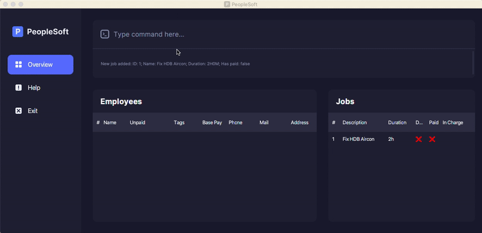

PeopleSoft is a CLI-based contractor payroll management app. It helps **companies which offer contractor services** with managing how much each contractor is paid. You can:
- manage contractors
- manage jobs
- calculate monthly salary

It is written with the OOP paradigm in mind and has ~6 KLoC.
* View the User Guide and Developer Guide on our **[Website](https://ay2122s2-cs2103t-t11-4.github.io/tp/)**.

This project is based on the AddressBook-Level3 project created by the [SE-EDU initiative](https://se-education.org).

**Acknowledgements**

* Libraries used: [JavaFX](https://openjfx.io/), [Jackson](https://github.com/FasterXML/jackson), [JUnit5](https://github.com/junit-team/junit5)
