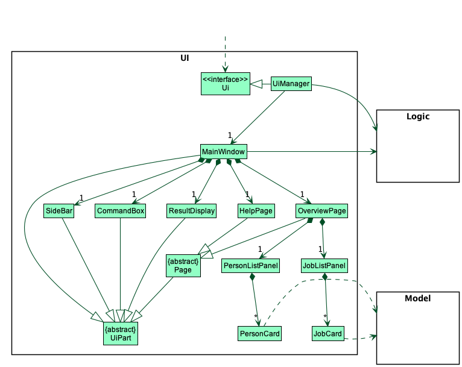
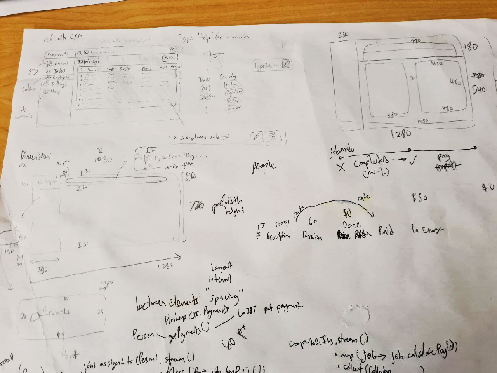

### Project: PeopleSoft

PeopleSoft is a Payroll management app for companies handling contractor-based services.

### Summary of Contributions

* **Role in team**: Team leader and frontend developer  
 
* **New Feature**: Added the ability to open the User Guide directly in the web browser. (Pull Request(PR) [\#77](https://github.com/AY2122S2-CS2103T-T11-4/tp/pull/77))
  * **What it does**: Allows the user to open the User Guide directly in the web browser.
  * **Justification**: This feature improves the product because it significantly reduces the number of steps a user needs to do to search for help. It also follows Jakob Nielsen's Revised Usability Heuristic H2-10: Help and documentation.
  * Credits: [Dave from StackOverflow](https://stackoverflow.com/questions/5226212/how-to-open-the-default-webbrowser-using-java/54869038#54869038) for opening the browser across OSes  
     

* **New Feature**: Added the sidebar and allowed the user to navigate between pages either using it, or using commands. (PR [\#222](https://github.com/AY2122S2-CS2103T-T11-4/tp/pull/222))
  * **What it does**: Gives the user multiple ways to change between pages (through both GUI and CLI)
  * **Justification**: This feature improves the product because it allows those unfamiliar with CLIs to easily navigate the app, and also provides an accelerator for experienced users (through typing) to navigate to their desired page. It also follows Jakob Nielsen's Revised Usability Heuristic H2-7: Flexibility & Efficiency.
  * **Highlights**: The implementation required the use of an association class. Comments left will guide a new collaborator in adding additional pages.  
     

* **Code contributed**: [RepoSense link](https://nus-cs2103-ay2122s2.github.io/tp-dashboard/?search=ian-from-dover&sort=groupTitle&sortWithin=title&since=2022-02-18&timeframe=commit&mergegroup=&groupSelect=groupByRepos&breakdown=true&checkedFileTypes=docs~functional-code~test-code~other&tabOpen=true&tabType=authorship&zFR=false&tabAuthor=ian-from-dover&tabRepo=AY2122S2-CS2103T-T11-4%2Ftp%5Bmaster%5D&authorshipIsMergeGroup=false&authorshipFileTypes=docs~functional-code~test-code~other&authorshipIsBinaryFileTypeChecked=false)  
   

* **Team tasks**:
  * Reviewed [44 PRs](https://github.com/AY2122S2-CS2103T-T11-4/tp/pulls?q=is%3Apr+is%3Aclosed+reviewed-by%3Aian-from-dover+) and offered non-trivial comments. (Eg. PR [\#235](https://github.com/AY2122S2-CS2103T-T11-4/tp/pull/235), [\#52](https://github.com/AY2122S2-CS2103T-T11-4/tp/pull/52), [\#218](https://github.com/AY2122S2-CS2103T-T11-4/tp/pull/218))
  * Ensured that issues and internal milestones were on schedule
  * Drafted meeting agendas and facilitated meeting discussion
  * Regularly updated tP deliverables document and served as point of contact with tutor
  * Made the release `v1.3.0` on GitHub  
     

* **Enhancements to existing features**:
  * Beautified the GUI and DG color schemes (PR [\#61](https://github.com/AY2122S2-CS2103T-T11-4/tp/pull/61), [\#221](https://github.com/AY2122S2-CS2103T-T11-4/tp/pull/221))
  * Implemented the displaying of almost all the features, including and not limited to:
    * `assign`ing people to jobs (PR [\#216](https://github.com/AY2122S2-CS2103T-T11-4/tp/pull/216))
    * Making the ResultDisplay language HR-manager friendly (PR [\#214](https://github.com/AY2122S2-CS2103T-T11-4/tp/pull/214))
    * Create new fields belonging to `People` such as `basePay` (PR [\#205](https://github.com/AY2122S2-CS2103T-T11-4/tp/pull/205))
    * Created the `JobListCards` and `JobListPanel` to display all the job information (PR [\#61](https://github.com/AY2122S2-CS2103T-T11-4/tp/pull/61) and [\#125](https://github.com/AY2122S2-CS2103T-T11-4/tp/pull/125))
    * Fixed bugs relating to all of the above.  
       

* **Documentation**:
  * User Guide:
    * Added the `How to use this guide` section
    * Added documentation for the features `job` `joblist`, `jobdelete` and `assign` (PR [\#86](https://github.com/AY2122S2-CS2103T-T11-4/tp/pull/86/files))
    * Added the `Glossary` section (PR [\#86](https://github.com/AY2122S2-CS2103T-T11-4/tp/pull/86/files) also)
    * Updated the command summary with the new job commands
    * Did cosmetic tweaks to existing documentation for the `mark` feature: (PR [\#118](https://github.com/AY2122S2-CS2103T-T11-4/tp/pull/118/))
    * Extensively researched 20 previous UGs to consolidate best practices for the team. (PR [\#203](https://github.com/AY2122S2-CS2103T-T11-4/tp/issues/203))
  * Developer Guide:
    * All changes are in PR [\#221](https://github.com/AY2122S2-CS2103T-T11-4/tp/pull/221):
    * Added introduction, target user profile and value proposition to the front
    * Added implementation details of the GUI under the [UI component section](https://ay2122s2-cs2103t-t11-4.github.io/tp/DeveloperGuide.html).
      
    * Tweaked User Stories
  * README:
    * Added animated GIF preview and crafted the write-up for skimming. (PR [\#36](https://github.com/AY2122S2-CS2103T-T11-4/tp/pull/36) and [\#222](https://github.com/AY2122S2-CS2103T-T11-4/tp/pull/222))  
   

* **Community**:
  * Contributed to [3 forum discussions](https://github.com/nus-cs2103-AY2122S2/forum/issues?q=is%3Aissue+author%3Aian-from-dover)
  * Reported [10 bugs and suggestions for other teams](https://github.com/ian-from-dover/ped/issues) in the class during Practical Exam Dry run (PE-D)  
     

* **Tools**:
  * Implemented a UI Kit found in Figma by emulating its design using JavaFX
  * Touched up all icons and images in Adobe Photoshop
  * Brainstormed multiple user interfaces by drawing wireframe sketches before chancing upon the UI Kit

